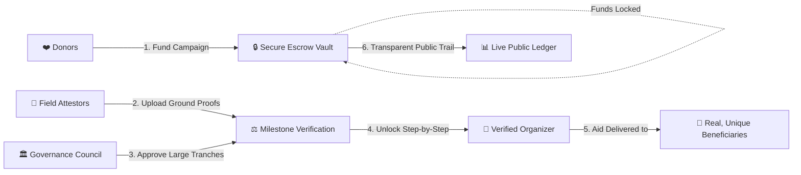
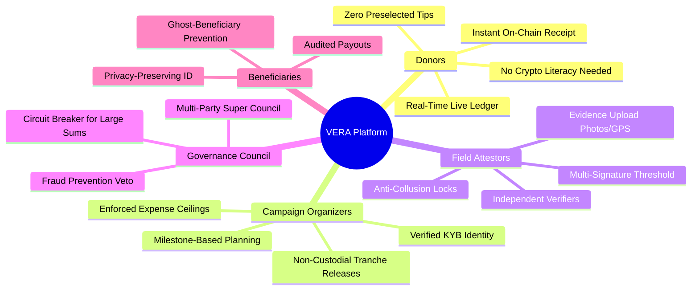
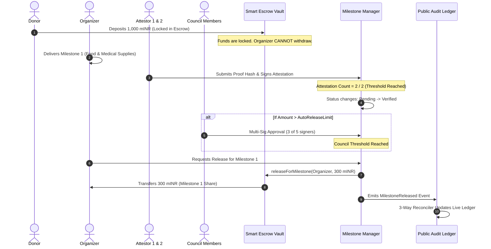

# VERA: Verified Escrow & Relief Architecture
### A Milestone-Gated, Fraud-Proof Crowdfunding & Humanitarian Aid Protocol

---

## 1. Executive Summary & Vision

**VERA (Verified Escrow & Relief Architecture)** is a next-generation decentralized crowdfunding and disaster relief platform designed to solve the multi-billion-dollar crisis of trust, fraud, and mismanagement in humanitarian aid and charitable giving.

Traditional donation platforms function like an **opaque black box**: once a donor clicks "Donate," money vanishes into an organization's bank account with zero verifiable guarantees that it actually reaches victims, purchases medical supplies, or builds shelters. 

VERA transforms this broken model into a **transparent, milestone-gated escrow system**. Funds are never handed over upfront in a lump sum. Instead, donations are locked in smart escrows on the blockchain and released only in verified stages when independent field verifiers, cryptographic evidence, and multi-party governance councils confirm that the actual on-the-ground work has been completed.



---

## 2. The Core Problem: Why Modern Charity is Broken

Every year, hundreds of billions of dollars are donated globally to disaster relief and charitable causes. However, the existing infrastructure suffers from severe structural flaws:

| Problem in Legacy Systems | What Really Happens | Real-World Consequence |
| :--- | :--- | :--- |
| **The "Black Box" Problem** | Donors have zero visibility into where their money goes after checkout. | Donors lose trust; cynicism reduces recurring contributions. |
| **Overhead Fee Gouging** | Fraudulent or inefficient charities consume 60% to 90% of funds on "administrative expenses," marketing, and executive salaries. | Starving victims receive pennies on the dollar. |
| **All-or-Nothing Upfront Payouts** | Platforms like GoFundMe release 100% of funds immediately to the organizer before a single shovel touches the ground. | Dishonest actors collect millions, abandon the project, or misuse the capital. |
| **"Ghost Beneficiaries" & Double Dipping** | Relief agencies claim they distributed aid to 10,000 victims when they only helped 500, pocketing the difference. | Double counting and phantom recipient lists drain emergency budgets. |
| **Insider Collusion** | Executives approve payments to affiliated contractors or personal accounts without independent third-party checks. | Aid funds are siphoned off through inflated or fake vendor invoices. |
| **Predatory "Tipping" & Hidden Fees** | Commercial crowdfunding platforms trick donors with pre-selected 15% tips or ambiguous deduction fees. | Donors feel deceived during checkout. |

---

## 3. The VERA Solution: A New Paradigm of Trust

VERA replaces blind trust with **cryptographic and structural guarantees**:

1.  **Milestone-Gated Smart Escrow**: Capital is released strictly in sequential percentages (e.g., $30\% \to 40\% \to 30\%$). Milestone 2 cannot receive funds until Milestone 1 is physically verified.
2.  **Hard-Coded Overhead Ceilings**: Administrative expenses are capped by smart contracts (e.g., maximum 10% for disaster relief). A campaign cannot physically allocate 90% overhead even if an organizer tries.
3.  **Independent Multi-Attestor Verification ($M$-of-$N$)**: Ground progress requires sign-off by at least two independent, verified verifiers who upload cryptographic evidence hashes. Organizers cannot self-verify.
4.  **Governance Council Oversight ($K$-of-$L$)**: Large fund releases (e.g., $>100\text{ mINR}$) require multi-signature approval from an independent supervisory council, preventing rogue rings from draining capital.
5.  **Ghost-Beneficiary Elimination**: Beneficiaries are registered using privacy-preserving digital identity commitments. The system mathematically prevents the same person from claiming duplicate relief packages without revealing their private identity.
6.  **Continuous 3-Way Reconciled Ledger**: A real-time, public audit dashboard compares every event against blockchain storage, updating every 10 seconds with zero login required.

---

## 4. Key Platform Roles & Feature Breakdown



---

### 4.1 Donors: Effortless, Fair, and 100% Traceable Giving
*   **Zero Crypto Literacy Required**: Donors sign up with just an email and password. VERA automatically provisions a secure, encrypted wallet behind the scenes.
*   **Fair & Transparent Checkout**: No pre-selected platform tips. Any platform support fee is an explicit, opt-in choice alongside an unambiguous "$0 / No Tip" option.
*   **Step-by-Step Deposit Safety**: The donation engine uses an atomic state machine (`gas` $\to$ `mint` $\to$ `approve` $\to$ `deposit`) ensuring that donations never get lost mid-flight.
*   **Permanent Public Receipts**: Every contribution generates a verifiable blockchain transaction hash viewable on public explorers.

---

### 4.2 Campaign Organizers: Accountable Humanitarian Leadership
*   **Strict Organizer KYB (Know Your Business)**: An organizer must submit their official registration number, organization credentials, and legal documents. Only administrators can approve an organizer before they can launch campaigns.
*   **Milestone-Based Campaign Creation**: When creating a campaign (e.g., "Assam Flood Relief"), the organizer defines:
    1.  *Category* (Disaster Relief, Medical Emergency, Community Infrastructure).
    2.  *Total Target Amount*.
    3.  *Administrative Fee Cap* (enforced to not exceed the category ceiling: 10% for relief, 15% for medical, 20% for community).
    4.  *Sequential Milestones* (e.g., Milestone 1: Emergency Food Kits - 30%, Milestone 2: Water Purification Units - 40%, Milestone 3: Temporary Shelters - 30%). Total milestone percentages must equal exactly 100%.
*   **No Direct Withdrawal Privileges**: Organizers cannot withdraw money at will. Funds move directly from the escrow vault to the organizer only when milestone conditions are met on-chain.

---

### 4.3 Field Attestors: Independent On-the-Ground Verification
*   **Who They Are**: Independent engineers, NGO observers, local doctors, or trusted auditors authorized to verify progress.
*   **Evidence Hash Submissions**: An attestor inspects field work (e.g., delivery trucks arriving, water filters installed) and uploads proof documents, geotagged photos, or invoices. The browser generates a cryptographic SHA-256 hash of this evidence and anchors it to the blockchain.
*   **Multi-Confirmation Requirement**: A single attestor cannot unlock a milestone alone. A minimum of 2 separate attestors must independently verify the work.
*   **Self-Attestation Ban**: The smart contract mathematically prohibits the campaign organizer from acting as an attestor on their own campaign.

---

### 4.4 Governance Council: High-Value Circuit Breakers
*   **Who They Are**: A multi-organizational oversight body (e.g., representatives from Red Cross, civil society, municipal authorities).
*   **Threshold Multi-Sig ($K$-of-$L$)**: 
    *   Small milestone releases below the automatic release limit (e.g., 100 mINR) release immediately upon field attestation.
    *   Major financial releases above the limit require multi-signature approval from the Council (e.g., 3 out of 5 council members must independently review and approve).
*   **Anti-Collusion Circuit Breaker**: If a field attestor is compromised or coerced, the governance council acts as an emergency stop mechanism before large funds leave the vault.

---

### 4.5 Beneficiaries & Duplicate Relief Prevention
*   **The Problem of Double Dipping**: In disaster zones, organized syndicates or opportunistic individuals often collect relief rations from multiple aid stations, leaving vulnerable families empty-handed.
*   **Privacy-Preserving Uniqueness Registry**:
    1.  Field agents record a national ID or ration card.
    2.  The browser immediately hashes the ID with a program-specific cryptographic salt (`SHA256(ID + Salt)`).
    3.  Only the irreversible hash is sent to the blockchain.
    4.  If the same individual attempts to claim aid twice in the same program, the smart contract rejects the registration with `DuplicateBeneficiary()`.
    5.  **Zero PII Leakage**: No citizen names, phone numbers, or government IDs are ever stored on the public blockchain or platform database.

---

## 5. Milestone Lifecycle: From Donation to Release

Here is the exact step-by-step journey of relief funds in VERA:



---

## 6. Public Audit & Reconciliation Dashboard

The core promise of VERA is **verifiable transparency**. Anyone in the world can visit a campaign's public dashboard without creating an account or logging in.

### What the Public Sees:
1.  **Total Funds Raised vs Total Funds Released**: Clear breakdown of locked escrow capital versus disbursed tranches.
2.  **Milestone Progress Bars**: Visual status of every milestone (`Pending`, `Verified`, `Released`).
3.  **Real-Time Proof Explorer**: Direct links to view the cryptographic evidence hashes submitted by field attestors.
4.  **Live 3-Way Reconciliation Badge**:
    *   **Green Badge (Triple Verified)**: Proves mathematically that the sum of all donation events minus releases equals the exact token balance held in the smart contract.
    *   **Amber Warning**: Displays if the local viewer is experiencing network lag behind the blockchain.
5.  **Audit Data Export**: Instant download of the full transaction history in CSV and JSON formats for independent journalists, donors, and regulatory bodies.

---

## 7. Real-World Case Scenario: Flood Relief in Action

To understand the transformative power of VERA, consider a real-world disaster response:

### Scenario: *Assam Monsoon Emergency Relief 2026*
*   **Goal**: ₹10,00,000 (10 Lakhs INR / 1,00,0000 mINR)
*   **Milestones**:
    *   *Milestone 1 (30%)*: ₹3,00,000 — 2,000 Dry Ration & Clean Water Kits.
    *   *Milestone 2 (40%)*: ₹4,00,000 — 5 Mobile Medical Camps & Water Purification Units.
    *   *Milestone 3 (30%)*: ₹3,00,000 — Temporary Tin Roofing & Rehabilitation Kits.
*   **Admin Overhead Cap**: 10% (Maximum ₹1,00,000 allowed for logistics and ground staff).

### What Happens in VERA vs Traditional Crowdfunding:

| Event | Traditional Crowdfunding (GoFundMe / Centralized NGO) | VERA Protocol |
| :--- | :--- | :--- |
| **Donations Reach ₹10 Lakhs** | Organizer withdraws ₹10 Lakhs into a private bank account immediately. | ₹10 Lakhs is locked inside `CampaignVault.sol`. Zero money leaves. |
| **Milestone 1 Execution** | Organizer claims they bought rations; no public receipts are required. | Organizer buys rations. 2 independent Red Cross & local NGO attestors upload geo-tagged photos and invoice hashes. |
| **Fund Release 1** | Already spent or pocketed upfront. | `MilestoneManager` unlocks exactly ₹3,00,000 to the organizer. Remaining ₹7,00,000 stays safely locked. |
| **Fraud / Abandonment Attempt** | If the organizer disappears, ₹7,00,000 is lost forever. Donors have no recourse. | Milestone 2 is never verified. **₹7,00,000 remains safely protected in escrow** and can be refunded or reassigned. |
| **Beneficiary Distribution** | Corrupt intermediaries hand aid to friends multiple times. | Beneficiaries are verified via privacy-preserving digital hashes, preventing double claims. |

---

## 8. Competitive Advantage: How VERA Compares

```mermaid
quadrantChart
    title Transparency vs Security Matrix
    x-axis Low Transparency --> High Transparency
    y-axis Low Fund Security --> High Fund Security
    quadrant-1 Maximum Trust (VERA)
    quadrant-2 High Security, Low Visibility
    quadrant-3 High Risk (Legacy Platforms)
    quadrant-4 Public but Unsecured
    Traditional NGOs: [0.2, 0.35]
    GoFundMe / Ketto: [0.3, 0.25]
    Generic Crypto DAOs: [0.75, 0.45]
    VERA Protocol: [0.95, 0.95]
```

| Feature / Metric | Traditional Platforms (GoFundMe, Ketto, Milaap) | Traditional Large NGOs | Standard Web3 DAOs | VERA Protocol |
| :--- | :---: | :---: | :---: | :---: |
| **Milestone-Gated Releases** | ❌ No (100% Upfront) | ❌ No (Internal Discretion) | ⚠️ Partial (Complex Voting) | ✅ **Yes (Enforced On-Chain)** |
| **Admin Fee Limits** | ❌ No Limit (Often 20-40%) | ❌ Variable (Up to 80%) | ❌ N/A | ✅ **Hard-Capped (10-20%)** |
| **Multi-Attestor Verification** | ❌ None | ❌ Internal Auditors Only | ❌ Token Whale Voting | ✅ **$M$-of-$N$ Field Verifiers** |
| **Council Circuit Breakers** | ❌ None | ❌ Bureaucratic Delays | ❌ Susceptible to 51% Attacks | ✅ **$K$-of-$L$ Governance Council** |
| **Duplicate Beneficiary Block**| ❌ None | ⚠️ Paper Records (Manual) | ❌ None | ✅ **Cryptographic ID Registry** |
| **Real-Time 3-Way Audit** | ❌ No | ❌ Annual PDF Reports | ⚠️ Explorer Only (Raw Bytes) | ✅ **Live 10s Automated Ledger** |
| **Non-Technical User UX** | ✅ High | ⚠️ Medium | ❌ Very Low (Requires Metamask) | ✅ **High (Zero-Crypto Experience)** |

---

## 9. Conclusion & Impact

VERA is not just another crowdfunding portal; it is an **institutional trust architecture**. By combining the user-friendliness of modern consumer web apps with the uncompromised security of blockchain smart escrows, VERA proves that humanitarian relief can be **efficient, tamper-proof, and 100% transparent**.

Every donor knows where their money is. Every dollar is earned through physical proof. Every beneficiary is protected.
