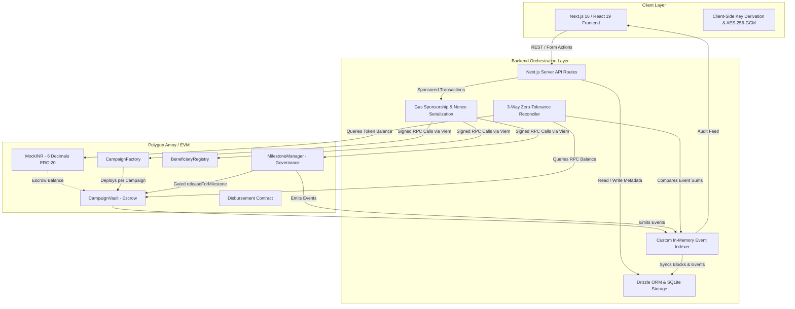
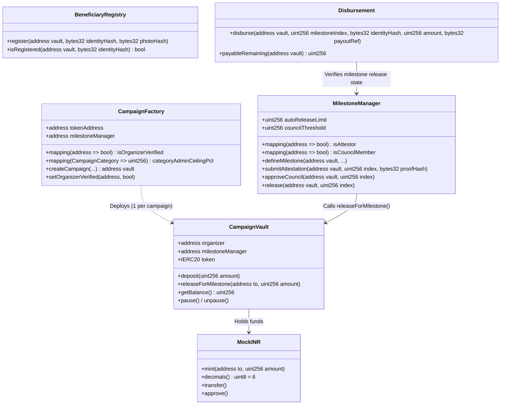
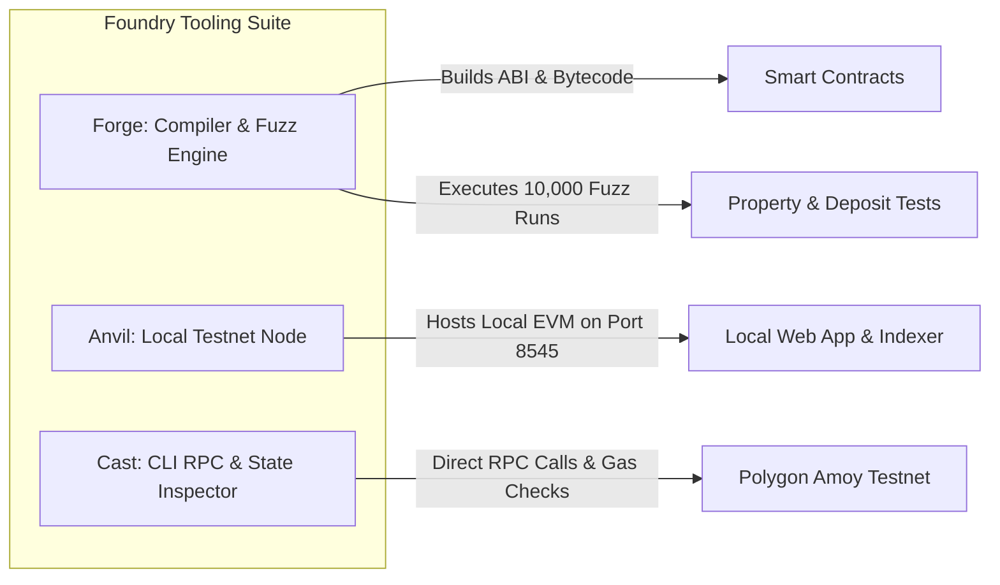
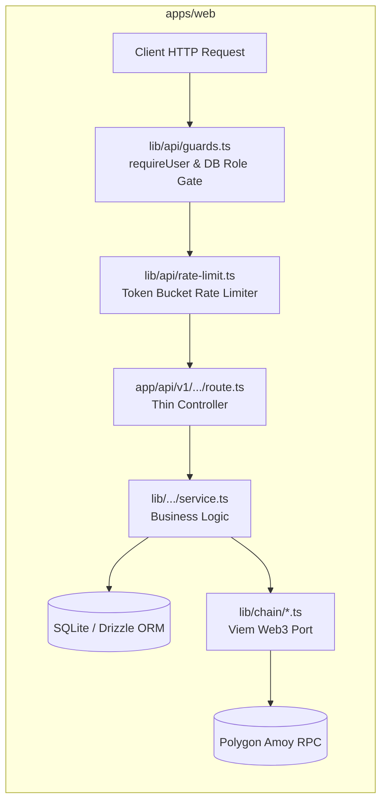
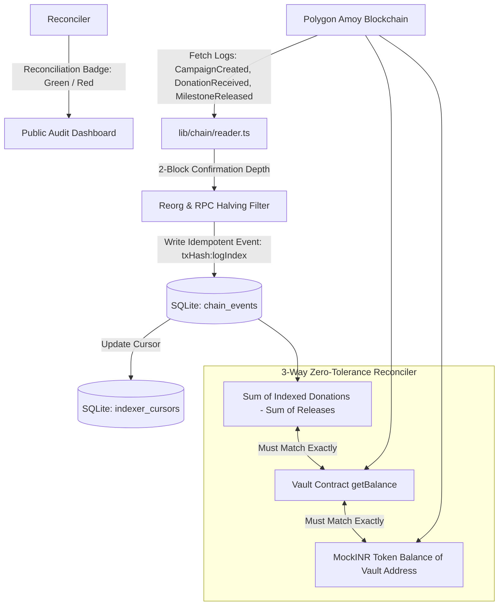

# VERA (Verified Escrow & Relief Architecture) — Technical Architecture & Implementation Deep-Dive

---

## 1. Executive Technical Summary

**VERA (Verified Escrow & Relief Architecture)** is a high-assurance, milestone-gated escrow and transparent disaster relief protocol deployed on the **Polygon Amoy Testnet (EVM)** with a full-stack modern web orchestration layer. 

The architecture bridges the trust gap in humanitarian aid, philanthropic crowdfunding, and disaster relief by replacing opaque, centralized fund disbursement with **deterministic smart contract escrows**, **multi-party threshold attestations ($M$-of-$N$)**, **governance council circuit breakers ($K$-of-$L$)**, **zero-leakage cryptographic beneficiary registries**, and an **in-memory event indexer featuring continuous 3-way mathematical ledger reconciliation**.



---

## 2. Technology Stack & Component Inventory

| Layer / Technology | Specific Version / Tool | Core Role in VERA | Implementation Location |
| :--- | :--- | :--- | :--- |
| **Blockchain Network** | Polygon Amoy Testnet (Chain ID `80002`) | High-speed, EVM-compatible decentralized settlement layer | On-chain deployment |
| **Local Chain Simulator** | Foundry `anvil` | Local ephemeral blockchain node with 1s block time for 0-cost deterministic automated/manual testing | Local dev environment (`http://127.0.0.1:8545`) |
| **Smart Contract Tooling** | Foundry `forge` & `cast` | Contract compilation, deployment scripts, gas profiling, fuzz testing (10k iterations) | `contracts/` directory |
| **Smart Contract Lang** | Solidity `^0.8.24` | Immutable escrow, access control, threshold verification, and math invariant enforcement | `contracts/src/*.sol` |
| **Security Base Libs** | OpenZeppelin Contracts `v5.0` | `Ownable`, `ReentrancyGuard`, `IERC20` baseline implementations | `contracts/lib/openzeppelin-contracts/` |
| **Full-Stack Framework** | Next.js `16.2.11` (App Router) | Server-side rendering (SSR), Server Components, and zero-latency route handlers (`/api/v1`) | `apps/web/` |
| **Frontend Runtime** | React `19.2.4` + TypeScript `5.x` | Modern reactive UI, optimistic updates, and strict typing | `apps/web/app/`, `apps/web/components/` |
| **Styling & Design System**| Tailwind CSS `v4.0` | Sleek dark-mode aesthetic, financial dashboards, glassmorphism, responsive tables | `apps/web/app/globals.css` |
| **Database & ORM** | SQLite (`better-sqlite3`) + Drizzle ORM | Fast, embedded ACID relational store for off-chain profiles, state machines, and indexer cursors | `apps/web/lib/db/` |
| **Web3 Client Engine** | Viem `v2.56.7` | Type-safe JSON-RPC interface, contract simulation, event decoding, raw transaction signing | `apps/web/lib/chain/` |
| **Manual/ad hoc E2E** | Chrome DevTools, occasionally a scratch Playwright-core script | Multi-role walkthroughs (Admin, Donor, Attestor, Council) verified by hand; not part of the committed test suite | `docs/manual_test.md` (script), scratch folders (not in the repo) |
| **Unit & Integration Test**| Vitest `v5.0.1` | Fast unit testing of cryptography, token buckets, and donation state machines | `apps/web/lib/**/*.test.ts` |
| **Authentication & Crypto**| `jose` + `bcryptjs` + Web Crypto API | HS256 JWT sessions in HttpOnly cookies, bcrypt password hashing, AES-256-GCM wallet encryption | `apps/web/lib/auth/` |
| **Data Validation** | Zod `v4.6.5` | Shared runtime schema validation for API requests and UI form inputs | `apps/web/lib/campaigns/validation.ts` |

---

## 3. Blockchain & Smart Contract Architecture

The on-chain system consists of six primary smart contracts written in Solidity `^0.8.24` utilizing OpenZeppelin `v5` contracts. 

### 3.1 Smart Contract Topology



### 3.2 Deep-Dive: Contract Specifications & Invariant Guarantees

#### 1. `MockINR.sol` (6-Decimal Mock Stablecoin)
*   **Purpose**: Simulates Indian Rupee (INR) fiat pegged stablecoin for humanitarian relief without requiring real capital on testnets.
*   **Precision**: Configured strictly to 6 decimals (`1 mINR = 1,000,000 minor units`).
*   **Security & Minting**: Provides an open `mint(address to, uint256 amount)` interface allowing the gas-sponsored relay to fund test donors seamlessly on-demand.

#### 2. `CampaignFactory.sol` (Registry & Deployment Gatekeeper)
*   **Purpose**: Centralized on-chain factory enforcing strict campaign creation invariants.
*   **Enforced Invariants**:
    1.  **Organizer KYB Gate**: `require(isOrganizerVerified[msg.sender], "OrganizerNotVerified")` — unverified accounts cannot deploy campaigns.
    2.  **Overhead Ceiling Enforcement**: Hard-coded administrative fee caps per category (`DisasterRelief = 10%`, `Medical = 15%`, `Community = 20%`). Any campaign declaring `adminCapPct > categoryCeiling` reverts on-chain.
    3.  **Milestone Percentage Conservation**: The sum of milestone target percentages must equal exactly `100%` ($\sum \text{targetPct}_i = 100$).
    4.  **Immutable Binding**: Deploys a new `CampaignVault` per campaign and binds it permanently to the verified `MilestoneManager`.

#### 3. `CampaignVault.sol` (Non-Custodial Escrow Vault)
*   **Purpose**: Securely custody deposited `MockINR` tokens for a specific campaign.
*   **Access Control**:
    *   `releaseForMilestone(address to, uint256 amount)` is strictly protected by `onlyMilestoneManager`.
    *   The `milestoneManager` address is `immutable` (assigned at deployment in constructor). Organizers and platform admins have zero permission to withdraw or transfer funds directly.
*   **Reentrancy Guard**: Inherits OpenZeppelin `ReentrancyGuard` on all state-modifying functions.
*   **Emergency Circuit Breaker**: Organizer-gated `pause()` / `unpause()` mechanism to halt deposits in exceptional disaster-zone compromises.

#### 4. `MilestoneManager.sol` (Governance & Multi-Party Orchestration)
*   **Purpose**: Coordinates the state machine of all milestones across all deployed vaults.
*   **State Machine**:
    $$\text{Pending} \xrightarrow[\ge M \text{ Attestations}]{\text{submitAttestation}} \text{Verified} \xrightarrow[\text{If } > \text{AutoReleaseLimit}, \ge K \text{ Approvals}]{\text{approveCouncil}} \text{Released}$$
*   **Threshold Attestation Logic ($M$-of-$N$)**:
    *   Global pool of authorized field attestors (`isAttestor[address]`).
    *   Requires a minimum of 2 independent attestations (`MIN_REQUIRED_ATTESTATIONS = 2`).
    *   Anti-Collusion Guard: An organizer is forbidden from attesting to their own campaign (`require(msg.sender != vault.organizer())`).
    *   Idempotency & Double-Attestation Prevention: Each attestor can only submit once per milestone (`hasAttested[vault][index][attestor] == false`).
    *   Attestation payloads require a `bytes32 proofHash` (SHA-256 fingerprint of photos/invoices/GPS data).
*   **Council Oversight ($K$-of-$L$)**:
    *   Releases with cumulative payouts exceeding `autoReleaseLimit` (e.g., 100 mINR) require $K$ council member signatures (`councilThreshold >= 2`).
    *   Prevents rogue attestor rings from draining major capital allocations.
*   **Mathematical Release Calculation**:
    *   Calculates cumulative release entitlement:
        $$\text{Entitlement} = \left( \text{TotalRaised} \times \frac{\sum_{j=0}^{i} \text{targetPct}_j}{100} \right) - \text{TotalPreviouslyReleased}$$
    *   Ensures that an underfunded campaign still disburses proportional shares without arithmetic underflow.

#### 5. `BeneficiaryRegistry.sol` (Privacy-Preserving Uniqueness Registry) — deployed, Amoy `0xA4BF48D348246f66281B8Ca191F3981e15E5C54D`
*   **Purpose**: Prevents "ghost beneficiaries" and duplicate relief claim fraud across disaster zones without recording personally identifiable information (PII) on the public blockchain.
*   **Cryptographic Approach**:
    *   A field worker generates a client-side identity hash: `SHA256(salt + "\0" + normalized identity fragment)`, NFKC-normalized so the same name typed differently still collides on purpose.
    *   The "program" is the campaign's own vault address, not a separate `programId`, so `register(vault, identityHash, photoHash)` reuses the same organizer check the manager uses.
    *   A repeat `identityHash` for the same vault reverts with `DuplicateBeneficiary(vault, hash)`. No owner, no admin function.

#### 6. `Disbursement.sol` (Post-Release Payout Tracker) — written and tested, **not yet deployed**
*   **Purpose**: Connects on-chain released funds with actual field payments. Built downstream of the already-deployed, immutable `MilestoneManager` (a divergence from the original design, where the vault would release directly into `Disbursement`): the manager still pays the organizer, and this contract caps what the organizer can then record as paid out.
*   **Flow**: the organizer approves this contract for `amount` of mINR, then calls `disburse(vault, milestoneIndex, identityHash, amount, payoutRef)`. It refuses unless the milestone is Released on the real manager, the beneficiary is registered for that vault on the real registry, that milestone was not paid before, and the running total for the vault stays within `manager.releasedTotal(vault)`. Emits `PayoutRecorded(vault, milestoneIndex, identityHash, amount, payoutRef, organizer)` — the money itself comes to rest in the contract, since the actual bank/mobile-money transfer is simulated, not called.

---

## 4. Testing, Automation & Tooling Architecture

### 4.1 Foundry Suite: Forge, Anvil, and Cast



#### 1. Forge (Compilation, Fuzzing & Static Analysis)
*   **What it is**: Foundry's blazing-fast Rust-based testing framework and compiler for Solidity.
*   **Why we use it**: Sub-second test execution, native Solidity testing (no JS wrappers), and high-iteration property-based fuzz testing.
*   **Implementation**:
    *   `foundry.toml` configures fuzzing to **10,000 runs per test** (`runs = 10000`), subjecting deposit math, percentage calculations, and authorization matrices to extreme boundary values.
    *   `Deploy.s.sol` orchestrates deterministic multi-contract deployments.
    *   Slither, run across all six contracts together: 4 informational/low findings, 0 high, 0 medium (an uninitialized-local false positive, the documented "vault emits no event on release" design choice, and two deployer-controlled constructor params with no zero-address check — see `docs/PROGRESS_LOG.md`'s Module 4.3 entry).

#### 2. Anvil (Local Ephemeral Node)
*   **What it is**: A high-performance local Ethereum node bundled with Foundry.
*   **Why we use it**: Enables $0-cost, 100% deterministic local testing of the complete multi-user lifecycle without spending scarce Polygon Amoy POL or suffering testnet RPC rate limits.
*   **Configuration**:
    *   `anvil --chain-id 80002 --block-time 1`
    *   Sets chain ID to Amoy (`80002`) so the web app requires zero environment code changes.
    *   Forces `--block-time 1` to produce blocks every second, ensuring that the 2-block confirmation depth required by the indexer advances continuously.

#### 3. Cast (CLI RPC Diagnostics)
*   **What it is**: Foundry's command-line interface for executing raw RPC calls, reading blockchain storage slots, checking gas prices, and broadcasting raw transactions.
*   **Implementation in VERA**:
    *   Gas price monitoring: Before any live testnet deployment, `cast gas-price` checks whether Polygon Amoy is experiencing a gas spike (preventing wallet depletion).
    *   Storage inspection: Validates raw vault balances (`cast balance` / `cast call`) against indexer tables.

---

### 4.2 Selenium / Headless Browser Automation & End-to-End Testing

#### What is Selenium & Why Is It Used?
**Selenium WebDriver** is an industry-standard browser automation framework that drives real browser engines (Google Chrome, Edge, Firefox) programmatically. 

In VERA, web3 interactions involve multiple concurrent actors:
1. **Platform Administrator** (KYB approval, role grants)
2. **Campaign Organizer** (Drafting, deploying, managing campaigns)
3. **Donors** (Authentication, token faucet minting, deposit execution)
4. **Field Attestors** (Uploading proof hashes, validating milestones)
5. **Council Members** (Signing multi-sig approvals)

Testing this ecosystem with simple API unit tests is insufficient because:
*   **React 19 Hydration Dynamics**: Wallet state and cryptographic keys are initialized client-side in the browser.
*   **State Machine Transitions**: A donation goes through 5 consecutive asynchronous states (`gas` $\to$ `mint` $\to$ `fee` $\to$ `approve` $\to$ `deposit`).
*   **Live Polling (no WebSockets)**: The public audit dashboard re-fetches the ledger every 10 seconds while the tab is visible, plain HTTP polling, not a push channel.

**Honest status, so this doesn't overstate it:** there is no committed, repeatable browser test suite in the repo — `pnpm test`/`pnpm test:web` are unit and integration tests against fake/in-memory chains, and that gap is tracked in `docs/PROGRESS_LOG.md`. The full multi-actor walkthrough below has been run by hand and, on a few sessions, with a scratch (not committed) Playwright-core script driving a real Chrome — useful for catching UI-only bugs a route test can't see, but not something `pnpm test` runs today.

#### How the manual/scratch browser walkthrough works
*   **Multi-Context Session Orchestration**: separate incognito browser windows/profiles represent each distinct actor simultaneously (one cookie = one signed-in person).
*   **Step-by-Step Scenario** (see `docs/manual_test.md` for the full script, runnable at 0 POL against a local anvil chain):
    1.  *Admin Context*: Logs in, approves pending organizer KYB, sets on-chain attestor role.
    2.  *Organizer Context*: Creates "Assam Flood Relief 2026" with 3 milestones, deploys vault on Anvil.
    3.  *Donor Context*: Registers new user, receives auto-generated AES-256 encrypted wallet, mints 500 mINR, and executes deposit.
    4.  *Attestor Context*: Uploads hash of relief delivery photos, advancing Milestone 1 to Verified.
    5.  *Council Context*: Signs approval for releases exceeding the 100 mINR limit.
    6.  *Organizer Context*: Triggers release; funds move from Vault to Organizer.
    7.  *Public Context*: Verifies that the public ledger badge turns **Green (Reconciled)** with 0 lag blocks.

---

## 5. Web Application & Backend Architecture

The backend of VERA is designed as a secure, full-stack Next.js 16 application using the App Router.



### 5.1 Key Architectural Principles

1.  **Thin Route Handlers, Fat Services**:
    Route handlers in `app/api/v1/` contain zero business logic. They parse requests with Zod schemas, execute authorization guards, invoke the dedicated service in `lib/<domain>/service.ts`, and wrap responses in the standardized error envelope.
2.  **Stateless Authoritative RBAC**:
    Role-based access control reads user roles directly from SQLite on **every request** (`requireUser(request, ...roles)`), rather than trusting claims inside the JWT session cookie. If an admin promotes an organizer, permissions update immediately without requiring re-login.
3.  **Strict Error Envelope Pattern (SPDD §12.3)**:
    All API responses follow a structured JSON schema:
    ```json
    {
      "success": true,
      "data": { ... }
    }
    ```
    Or on failure:
    ```json
    {
      "success": false,
      "error": {
        "code": "MILESTONE_NOT_VERIFIED",
        "message": "Milestone requires 2 attestations before release.",
        "details": {}
      }
    }
    ```
4.  **Floating-Point Ban**:
    All monetary calculations are performed in 6-decimal integer minor units using native JavaScript `BigInt` and fixed-point math helpers (`lib/campaigns/money.ts`). Floats are strictly prohibited to eliminate rounding discrepancies.

---

## 6. Real-Time Indexing & 3-Way Reconciliation Engine

To ensure absolute trust without centralizing authority, VERA implements a custom real-time blockchain event indexer combined with a mathematical reconciliation engine (`apps/web/lib/indexer/`).



### 6.1 Indexer Operation Mechanics
*   **Event Streams**: Listens to `CampaignCreated`, `DonationReceived`, and `MilestoneReleased` events.
*   **Confirmation Safety**: Only ingests blocks that are at least **2 blocks deep** to guarantee immunity against chain reorganizations.
*   **Adaptive RPC Chunking**: Queries events in block chunks. If an RPC provider returns a timeout or range limit error, the chunk size automatically halves dynamically.
*   **Idempotent Ingestion**: Events are uniquely keyed by `txHash:logIndex` preventing duplicate accounting on retries.

### 6.2 The 3-Way Zero-Tolerance Reconciliation Algorithm
On every public ledger query, the system performs a triple-point verification:
1.  **$A$ (Indexed Event Ledger)**: $\sum \text{DonationReceived} - \sum \text{MilestoneReleased}$ from SQLite `chain_events`.
2.  **$B$ (Smart Contract Escrow State)**: `CampaignVault.getBalance()` called directly via JSON-RPC.
3.  **$C$ (ERC-20 Token Balance)**: `MockINR.balanceOf(vaultAddress)` called directly via JSON-RPC.

$$\text{Reconciliation Status} = \begin{cases} \mathbf{RECONCILED\ (GREEN)}, & \text{if } A = B = C \\ \mathbf{DISCREPANCY\ (RED)}, & \text{if } A \neq B \lor B \neq C \end{cases}$$

If even a single minor unit ($0.000001\text{ mINR}$) diverges, the public UI displays a bright red discrepancy alert, guaranteeing that platform manipulation is immediately visible to the world.

---

## 7. Cryptography, Key Management & Gas Sponsorship

### 7.1 Client-Side Custodial Wallet Security
To remove crypto friction for non-technical donors and charity organizers while preserving on-chain integrity:
1.  **Key Generation**: Upon registration, a standard EVM private key is generated.
2.  **Envelope Encryption**: The private key is encrypted immediately using **AES-256-GCM** with an initialization vector (IV) and authentication tag:
    $$\text{Ciphertext} = \text{AES-256-GCM}(\text{PrivateKey}, \text{WALLET\_ENCRYPTION\_KEY}, \text{IV})$$
3.  **Key Storage**: Only the encrypted ciphertext and IV are stored in SQLite. Raw private keys are never logged, never exposed to client browsers, and never returned in API payloads.

### 7.2 Gas Sponsorship Engine (`sponsor.ts`)
*   **Problem**: Newly registered users have 0 POL (gas currency) and cannot pay transaction fees.
*   **Solution**: A dedicated platform sponsor wallet automatically tops up user wallets with POL before transaction execution.
*   **Nonce Serialization**: A critical queueing lock prevents race conditions and nonce collisions when multiple donors transact simultaneously.
*   **Gas Spike Protection**: The sponsor engine monitors network base fees; if the gas price exceeds 150 gwei, execution pauses to protect the sponsor wallet from drain attacks.

### 7.3 Uploaded Documents (KYB / Milestone Evidence)
Organizer KYB documents and attestor milestone evidence are hashed client-side (SHA-256) as before — that hash is still what travels on-chain / into `proofHash` — but the file bytes are also uploaded and stored (SQLite blob, `documents` table, migration `0008`), so an admin (KYB) or admin/attestor/council (evidence) can actually open what was submitted. The server independently re-hashes the uploaded bytes and refuses a mismatch, so the hash still proves what was reviewed. Uploads are capped at 8 MB and restricted to a JPEG/PNG/WEBP/GIF/PDF allowlist — never a script-executable type — and served back through a role-gated `GET /api/v1/documents/:id` route. This reverses an earlier "hash only, file never leaves the browser" design choice, done deliberately at the project owner's request; see `docs/PROGRESS_LOG.md`'s 2026-09-29 entry.

---

## 8. Deployment & Execution Runbook

### 8.1 Local Zero-Cost Testing Runbook (Anvil)

```bash
# Terminal 1: Launch local EVM node
anvil --chain-id 80002 --block-time 1

# Terminal 2: Deploy Contracts
cd contracts
R=http://127.0.0.1:8545
K=0xac0974bec39a17e36ba4a6b4d238ff944bacb478cbed5efcae784d7bf4f2ff80

# 1. Deploy MockINR
forge create src/MockINR.sol:MockINR --rpc-url $R --private-key $K --broadcast

# 2. Deploy MilestoneManager (autoReleaseLimit: 100 mINR = 100000000 minor units, councilThreshold: 3)
forge create src/MilestoneManager.sol:MilestoneManager --rpc-url $R --private-key $K --broadcast --constructor-args 100000000 3

# 3. Deploy CampaignFactory
forge create src/CampaignFactory.sol:CampaignFactory --rpc-url $R --private-key $K --broadcast --constructor-args <MOCK_INR_ADDRESS>

# 4. Deploy BeneficiaryRegistry (no constructor args; needed for Step 13/14 testing)
forge create src/BeneficiaryRegistry.sol:BeneficiaryRegistry --rpc-url $R --private-key $K --broadcast

# 5. Deploy Disbursement (token, manager, registry addresses from steps 1, 2, 4; needed for Step 14 testing)
forge create src/Disbursement.sol:Disbursement --rpc-url $R --private-key $K --broadcast --constructor-args <MOCK_INR_ADDRESS> <MILESTONE_MANAGER_ADDRESS> <REGISTRY_ADDRESS>

# Terminal 3: Run Full-Stack Web App
cd apps/web
pnpm install
pnpm dev
# App is live at http://localhost:3000
```

### 8.2 Production / Testnet Polygon Amoy Deployment Details

| Contract Name | Polygon Amoy Contract Address | Deployment Block |
| :--- | :--- | :--- |
| **MockINR (`mINR`)** | `0x9b6f00a1ce627a3e0d2da601253704084d8fc52c` | `47969900` |
| **CampaignFactory** | `0x6931E776da5db1D9e5890407FE268705D70740bD` | `47969967` |
| **MilestoneManager** | `0xe6d7222dDe3eE4b9688269427631aDF49229e747` | `47997230` |
| **BeneficiaryRegistry** | `0xA4BF48D348246f66281B8Ca191F3981e15E5C54D` | `48161539` |
| **Disbursement** | not yet deployed | — |

---

## 9. Technical Invariant & Security Verification Summary

| Vector / Attack Scenario | Architectural Defense Mechanism | Enforcement Layer |
| :--- | :--- | :--- |
| **Overhead Fee Gouging** (e.g. 90% admin cut) | Category fee ceilings (10/15/20%) enforced in contract constructor | `CampaignFactory.sol` |
| **Milestone Under/Over-Allocation** | Strict check: $\sum \text{targetPct}_i == 100$ | `CampaignFactory.sol` & `validation.ts` |
| **Direct Vault Draining** | `releaseForMilestone()` restricted strictly to immutable `MilestoneManager` | `CampaignVault.sol` |
| **Single-Attestor Collusion** | Minimum 2 distinct attestors required per milestone | `MilestoneManager.sol` |
| **Self-Attestation by Organizer** | `msg.sender != organizer` enforced on-chain | `MilestoneManager.sol` |
| **Large Disbursement Takeover** | Releases > 100 mINR require 3-of-5 Council approvals | `MilestoneManager.sol` |
| **Ghost Beneficiary Duplication** | On-chain identity hash check per vault | `BeneficiaryRegistry.sol` |
| **Payout Exceeding What Was Released** | `disbursedTotal[vault] + amount <= manager.releasedTotal(vault)`, checked on-chain | `Disbursement.sol` |
| **Double-Paying a Milestone** | `isDisbursed[vault][milestoneIndex]` set before the token transfer, checked first | `Disbursement.sol` |
| **Double Spending / Reentrancy** | OpenZeppelin `ReentrancyGuard` on all state-modifying escrow paths | `CampaignVault.sol` & `MilestoneManager.sol` |
| **Silent Database Ledger Drift** | Continuous 3-way reconciliation comparing event logs to raw storage balances | `apps/web/lib/indexer/` |
