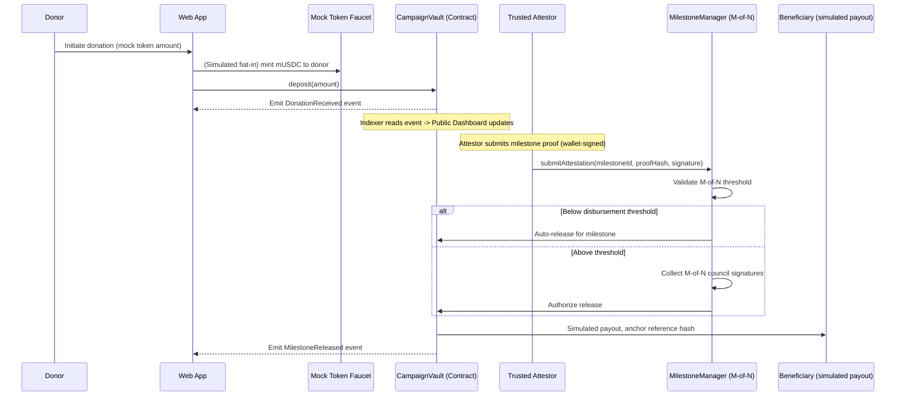
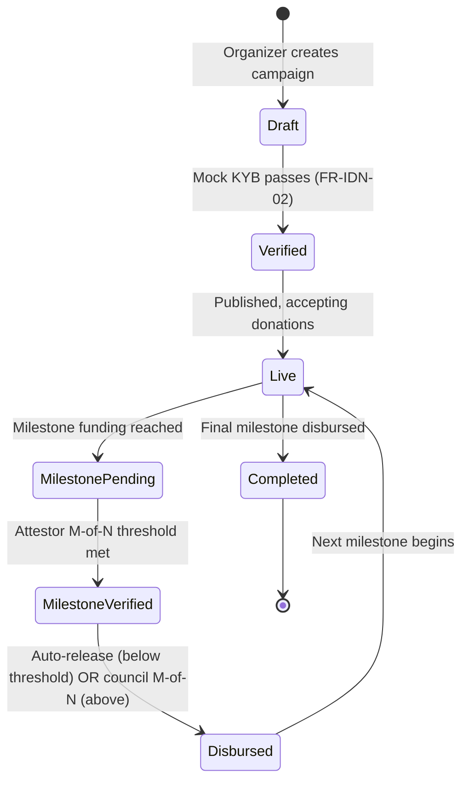
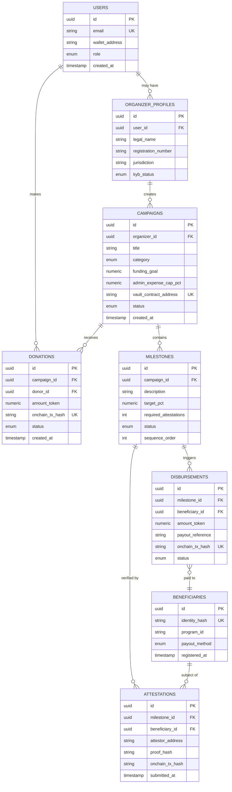
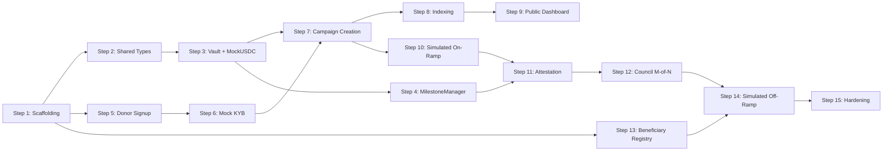

# VERA — Verified Escrow & Relief Architecture (MVP / PoC Edition)
## Software Project Design Document (SPDD)
### A Zero-Budget, Programmatically-Auditable Crowdfunding & Disaster-Relief Proof of Concept

**Document Type:** Single Source of Truth — Software Project Design Document (Scaled-Down MVP)
**Version:** 1.0-MVP
**Status:** Approved for Build (Final-Year College Project)
**Classification:** Academic — Proof of Concept, No Live Funds
**Prepared For:** Student build team (1–4 people)
**Prepared By:** Project Author / Chief Architect

---

## Document Control

| Field | Value |
|---|---|
| Document Owner | Project Author |
| Reviewers | Self-review + project supervisor / peer reviewer |
| Source Documents (Ground Truth) | `Problem_Defination__Crowd_Funding.md`, `Past_Case_Study___Crowd_Funding.md`, original full-scale `VERA_Crowdfunding_SPDD.md` |
| Source Documents (Advisory Only — Re-Engineered) | `Gaps_in_Current_Systems___Crowd_Funding.md`, `Solutions___Crowd_Funding.md`, `Ways_to_fix_gap___Crowd_Funding.md` |
| Revision Policy | Any change to Section 8 (Architecture) or Section 18 (Smart Contracts) should be self-reviewed and, where possible, peer/supervisor-reviewed before implementation |
| MVP Constraint Directive | **$0 total cost to build and run; free / open-source / free-tier technologies only; blockchain runs on a public *testnet*; no real money, no licensed partners, no paid APIs, no external audits.** |

---

## Table of Contents

1. [Document Control & Directive](#document-control)
2. [Executive Summary](#2-executive-summary)
3. [Grounding: Problem Statement & Case Evidence](#3-grounding-problem-statement--case-evidence)
4. [Critical Evaluation of Proposed Solutions (Architect's Judgment)](#4-critical-evaluation-of-proposed-solutions-architects-judgment)
5. [Functional Requirements](#5-functional-requirements)
6. [Non-Functional Requirements](#6-non-functional-requirements)
7. [Technology Stack](#7-technology-stack)
8. [System Architecture](#8-system-architecture)
9. [Module Breakdown](#9-module-breakdown)
10. [Development Phases](#10-development-phases)
11. [Database Design](#11-database-design)
12. [API Design](#12-api-design)
13. [Authentication & Authorization](#13-authentication--authorization)
14. [Folder Structure](#14-folder-structure)
15. [Coding Standards](#15-coding-standards)
16. [Detailed Implementation Roadmap](#16-detailed-implementation-roadmap)
17. [Algorithms & Core Mechanisms](#17-algorithms--core-mechanisms)
18. [Smart Contract Specifications](#18-smart-contract-specifications)
19. [Security Architecture & Threat Model](#19-security-architecture--threat-model)
20. [Compliance & Legal Framework](#20-compliance--legal-framework)
21. [Testing Strategy](#21-testing-strategy)
22. [Deployment & DevOps](#22-deployment--devops)
23. [Monitoring, Logging & Observability](#23-monitoring-logging--observability)
24. [Disaster Recovery & Business Continuity](#24-disaster-recovery--business-continuity)
25. [Risk Register](#25-risk-register)
26. [Timeline (4-Week Build)](#26-timeline-4-week-build)
27. [Team Structure](#27-team-structure)
28. [Cost Estimation](#28-cost-estimation)
29. [Glossary](#29-glossary)
30. [References](#30-references)

---

## 2. Executive Summary

### 2.1 Overview

VERA (**V**erified **E**scrow & **R**elief **A**rchitecture) — MVP edition — is a crowdfunding and disaster-relief **proof of concept** that replaces points of **blind trust** in the legacy charity pipeline with **programmatically verifiable truth**. This scaled-down version preserves the intellectual core of the full design — a public, immutable smart-contract ledger as the database of record, with the web app acting as a *view* onto that ledger — while running entirely on a public **testnet** so that the whole thing costs **$0 to build and operate**. It is deliberately *not* production software: there are no real funds, no licensed money-transmission partners, and no live donor risk. It exists to demonstrate that the trust guarantees are real and reconstructable from chain data.

### 2.2 Problem Statement (Restated From Ground Truth)

Per the Problem Definition and Past Case Study documents, capital donated to charitable causes is eroded at two structural points:

1. **Digital Drain** — payment-gateway fees, dark-pattern "tip" defaults, and cross-border FX spreads silently remove 6–18%+ of a donation before it ever reaches an organization (GoFundMe tip-slider case, Mumbai GST/refund case, cross-border 2.9%+$0.30 case).
2. **Institutional Vacuum** — once pooled, funds enter a closed-book environment where cash can be physically stolen (Ayodhya Trust ₹80 lakh case), assets can be flipped at fraudulent markups (₹16.5 Cr diversion), beneficiaries can be fabricated wholesale (Feeding Our Future, $250M / 97% laundered), mission can silently creep (FireAid, $100M diverted), and entire charities can operate as 99%-overhead marketing fronts (Women's Cancer Fund).

### 2.3 Current Challenges

| Challenge | Root Cause | Evidence |
|---|---|---|
| Value loss before impact | Legacy card-rail economics applied to charity | 2.9%+$0.30, 14–16.5% dark-pattern tips |
| No proof of delivery | Self-reported spreadsheets, no independent verification | Feeding Our Future ghost sites |
| No enforceable spend limits | Vague bylaws, discretionary board control | FireAid mission creep, 99% overhead fraud |
| No real-time visibility | Periodic, self-audited financial statements | Ayodhya land-flip, SantaCon shell company |
| Single points of failure in custody | One signatory / one custodian of funds | Insider cash theft, embezzlement |

### 2.4 Motivation

Every fraud vector closed converts directly into lives saved and surgeries funded. For the purposes of this academic project, the motivation is narrower but concrete: **prove, on real (test) chain infrastructure, that a donation's entire lifecycle can be made independently auditable and that the highest-value fraud vectors can be closed by code rather than by policy** — at zero cost, using only tools a student can access for free.

### 2.5 Objectives

1. Demonstrate a donation flow whose non-beneficiary leakage is a single, disclosed, on-chain line item (versus 6–18%+ hidden today) — on testnet, with a mock stablecoin.
2. Make **100% of (simulated) fund movement** — inflow, escrow lock, milestone release, disbursement — publicly and independently auditable from testnet chain data alone.
3. Make it **cryptographically impossible** (not merely against policy) to release escrowed funds without a verified milestone attestation.
4. Make it **structurally impossible** for a single actor to unilaterally move pooled funds (M-of-N in-contract approval).
5. Make beneficiary counts **provably unique** via an on-chain hash-commitment de-duplication check, without exposing raw identity data.
6. Do all of the above within a **$0 budget** using free/open-source/free-tier tools only.

### 2.6 Expected Outcomes

- A campaign's lifecycle — creation, funding, milestone definition, attestation, disbursement — is reconstructable by anyone from public testnet data and a block explorer, with no reliance on the operator's honesty.
- A hard-coded, on-chain administrative-expense cap makes a "Women's Cancer Fund"-style 99% diversion a smart-contract revert.
- Milestone-gated, multi-attestor-verified disbursement makes a "FireAid"-style redirection technically unexecutable without a public, auditable exception.

### 2.7 Business & Technical Value

- **Academic / demonstrative value:** the PoC shows that trust can be made a *provable property of the system* rather than a promise. This is the defensible thesis of the project.
- **Technical value:** the escrow, identity-commitment, and attestation primitives are composable and would generalize to medical crowdfunding, mutual aid, and grant disbursement without redesign — the same claim as the full system, now demonstrated on free infrastructure.

### 2.8 Innovation

The core innovation is **not** "put charity on the blockchain." It is the specific, minimal combination of (a) a free public testnet settlement layer, (b) milestone-gated non-custodial escrow with a trusted-attestor verification step, (c) multi-party (M-of-N) in-contract authorization for large disbursements, and (d) privacy-preserving beneficiary de-duplication via a simple on-chain hash commitment. Each expensive or exotic primitive from the full design (Chainlink oracles, Superfluid streaming, full ZK identity, licensed fiat ramps) has been **deliberately replaced with a free, simpler equivalent that demonstrates the same property**, as justified in Section 4.

---

## 3. Grounding: Problem Statement & Case Evidence

This section is non-negotiable: Sections 3 (this one) and the Past Case Study are **ground truth**, and every architectural decision in this document — including every simplification — traces back to a line item here.

### 3.1 Traceability Matrix — Problem → Architectural Answer

| # | Ground-Truth Problem (Doc 1/2) | Evidence Case | VERA MVP Architectural Answer | Section |
|---|---|---|---|---|
| P1 | Payment gateway fees penalize micro-donations | Cross-border FX bleed | Mock-stablecoin settlement on a free L2 testnet; fiat ramp *simulated*, so intake fee is a single disclosed on-chain line | §8.4, §18 |
| P2 | Dark-pattern tip sliders divert funds | GoFundMe $2,000 → $330 hidden tip | No tips; a single fixed, disclosed, on-chain protocol fee only (0% by default in the PoC) | §8.6, §18.3 |
| P3 | Cross-border FX spreads | 2.9%+$0.30 + FX case | Mock-token transfer bypasses banking entirely (demonstrated, not production-licensed) | §8.4 |
| P4 | Undisclosed deductions, no refund traceability | Mumbai ₹3,81,235 GST case | All fee deductions are on-chain line items, publicly queryable | §11, §18.4 |
| P5 | Physical cash theft by insiders | Ayodhya Trust ₹80 lakh theft | Funds never exist as physical cash; disbursement is a simulated digital payout only | §8.5 |
| P6 | Procurement/vendor asset-flipping fraud | Ayodhya ₹2 Cr → ₹18.5 Cr flip | M-of-N in-contract council approval required for any disbursement above a threshold | §18.2 |
| P7 | Fabricated / ghost beneficiaries | Feeding Our Future, $250M | On-chain hash-commitment uniqueness check required before first payout | §17.2, §18.5 |
| P8 | Mission creep / reallocation | FireAid $100M diverted | Funds are milestone-locked to the stated campaign; reallocation requires a logged on-chain exception | §18.3 |
| P9 | Marketing-agency fronts (99% overhead) | Women's Cancer Fund | Hard-coded, category-specific admin-expense ceiling enforced at the contract level | §18.3 |
| P10 | Unaudited shell-company routing | SantaCon NY $2.7M shell | All disbursement addresses are pre-registered and publicly labeled; unregistered address reverts | §13, §20 |
| P11 | Unauthorized scraping / unclaimed pages | 1.4M scraped charity pages | Organizer must complete a (mock) verification before a campaign can accept funds; no auto-generated pages | §9.1 |

### 3.2 Why the Evidence Rules Out Partial Fixes

The case evidence spans **both** ends of the pipeline — digital intake *and* institutional distribution. A fix that only addresses payment rails leaves P5–P11 open; one that only addresses governance leaves P1–P4 open, and paper dual-signature processes have historically been defeated by the same insiders they check (Ayodhya land-flip *had* board approval — the approving board was complicit). VERA therefore treats the **settlement layer and the governance layer as one integrated system**, even in the MVP. The simplifications in this document reduce *cost and operational surface*, never the integration of these two layers.

---

## 4. Critical Evaluation of Proposed Solutions (Architect's Judgment)

Documents 3–5 (Gaps, Solutions, Ways-to-fix) are **advisory only**. They correctly identify the *categories* of fix but overstate day-one feasibility. This MVP review keeps the full design's verdicts and adds a second axis — **cost and buildability by a student team at $0** — which forces further, deliberate simplification.

### 4.1 Primitive-by-Primitive Verdict (with MVP Cost Lens)

| Primitive (as pitched) | Full-Design Verdict | MVP ($0) Disposition |
|---|---|---|
| Public blockchain ledger | Accepted (L2, not new L1) | **Kept, on public *testnet*** (Polygon Amoy / Sepolia). Testnet gas is free via faucets; deployment and reads cost $0. This is the one primitive that must stay — it *is* the thesis. |
| Smart contract escrow | Accepted, harden oracle inputs | **Kept, simplified.** Escrow logic stays; the multi-source Chainlink oracle is replaced by a **trusted-attestor role** submitting wallet-signed attestations (the full design already names field-agent attestation as the MVP's simplest oracle type). |
| Multi-sig treasury | Accepted as-is (Safe) | **Kept, simplified.** Either a free **Safe on testnet** or a **minimal in-contract M-of-N** implemented directly in `MilestoneManager.sol`. Both are $0. |
| DIDs & ZK-Proofs | Rejected day-1; Phase-2 upgrade | **Rejected for the MVP entirely.** Replaced by a simple salted **SHA-256 hash commitment** for beneficiary uniqueness (no DID infrastructure, no ZK circuits). ZK is documented as future work only. |
| DAOs (donor governance) | Rejected; hybrid council | **Dropped from the MVP.** Donor advisory voting is out of scope for the PoC; only the fast M-of-N council for milestone approval is kept. |
| Streaming payments (Superfluid) | Added as donor kill-switch | **Dropped from the MVP.** Adds a second audited-protocol dependency and mainnet cost for no core-thesis benefit. Documented as future work. |
| Chainlink oracles / Automation | Chosen for multi-source aggregation | **Dropped.** Replaced by the trusted-attestor role above. Removes per-request cost and integration complexity. |
| Licensed fiat on/off-ramps | Chosen to hide crypto from donors | **Simulated.** A mock "faucet mint" of a test ERC-20 stands in for fiat-in; a logged mock payout stands in for fiat-out. Removes all licensing, cost, and KYC-partner dependencies. |
| AWS microservices + Datadog + Auth0 | Chosen for compliance/scale | **Collapsed** into a single free-tier stack (Next.js on Vercel + free-tier Postgres + open-source auth). See §7. |
| 2× external audits + bug bounty | Required before mainnet | **Replaced** by free static analysis (Slither), Foundry fuzz tests, and self/peer review. No mainnet, no live funds, so the audit gate does not apply. |

### 4.2 Retained Design Position on "Absolute Censorship Resistance"

The full design rejected *absolute* censorship-resistance as legally untenable and instead implemented "Decentralization With Compliance Guardrails." For the MVP, there are **no real funds and no real sanctions exposure**, so a full compliance-freeze subsystem is out of scope. A **minimal, optional `pause()` demonstration** may be included in `CampaignVault.sol` purely to illustrate the "bounded, disclosed exception" concept (emits a public event, cannot divert funds), but it is not a production compliance control.

### 4.3 What Was *Not* Simplified Away

The following are preserved because removing them would defeat the project's thesis: (a) on-chain escrow as source of truth, (b) milestone-gated release, (c) M-of-N approval for large disbursements, (d) on-chain beneficiary uniqueness, and (e) a public, independently-reconcilable dashboard. Everything cut is either a cost driver or a production-hardening concern irrelevant to a PoC.

### 4.4 Summary of Net Design Position

VERA-MVP is a **public *testnet* escrow system with milestone-gated, attestor-verified, M-of-N-approved disbursement and hash-based beneficiary uniqueness, fronted by a single free-tier web app — with fiat ramps, Chainlink, Superfluid, DAOs, full ZK, and enterprise cloud all deliberately removed or simulated.** Every deviation from the full design is a justified cost/scope trade-off, documented, not an oversight.

---

## 5. Functional Requirements

Numbering convention: `FR-<Module>-<Seq>`. Priority: P0 = PoC-blocking, P1 = nice-to-have-if-time, P2 = explicitly out of MVP scope.

### 5.1 Module: Identity & Onboarding (IDN)

**FR-IDN-01 — Donor Registration**
- **Purpose:** Allow a donor to create an account and get a testnet wallet without crypto literacy.
- **Description:** Donor signs up with email; a testnet wallet is either connected (MetaMask) or generated in-app for the demo. No seed-phrase management required in the primary flow.
- **Inputs:** Email, password (or wallet connect).
- **Outputs:** Donor account record; linked testnet wallet address.
- **Business/Validation Rules:** Email format validation; duplicate-account check by hashed email.
- **Acceptance Criteria:** New donor can register and see a $0 test-token balance within 60 seconds.
- **Priority:** P0
- **Dependencies:** Auth (§13), Wallet connect helper (§9.3)

**FR-IDN-02 — Organizer Verification (Mock KYB)**
- **Purpose:** Prevent unclaimed/auto-scraped pages and unverified organizers (Case: 1.4M scraped pages).
- **Description:** Organizer submits a legal name + registration number + a document upload. Verification is a **mock/manual approval** (admin approves in a simple console, or checks against a hard-coded allow-list) — no paid registry API.
- **Inputs:** Legal entity name, registration number, jurisdiction, proof document.
- **Outputs:** Organizer status (Pending / Verified / Rejected).
- **Business/Validation Rules:** No campaign may go live while "Pending"; only "Verified" organizers can create campaigns.
- **Acceptance Criteria:** A rejected organizer cannot create a campaign; a verified organizer's registration details are publicly visible on their profile.
- **Priority:** P0
- **Dependencies:** Admin approval flow (§9.6), Document storage (§9.6)

**FR-IDN-03 — Beneficiary Uniqueness Registration**
- **Purpose:** Eliminate ghost beneficiaries (Case: Feeding Our Future) while protecting privacy.
- **Description:** An organizer/agent registers a beneficiary by entering an identifying fragment that is **hashed in the browser** (SHA-256 + program salt) before transmission, plus an optional photo hash. The hash commitment is anchored on-chain.
- **Inputs:** Beneficiary identifying data (hashed client-side), program ID.
- **Outputs:** On-chain uniqueness commitment; beneficiary record with zero plaintext PII.
- **Business/Validation Rules:** A given hash may only register once per program (rejected by the DB unique constraint *and* re-checked on-chain by `BeneficiaryRegistry`).
- **Acceptance Criteria:** Registering the same beneficiary twice under the same program is rejected with an auditable reason code.
- **Priority:** P0
- **Dependencies:** Client-side hashing util, `BeneficiaryRegistry` contract (§18.5)

### 5.2 Module: Campaign Management (CMP)

**FR-CMP-01 — Create Campaign**
- **Purpose:** Let a verified organizer launch a fundable campaign with milestones defined up front.
- **Description:** Organizer defines title, category (Disaster Relief / Medical / Community), funding goal, admin-expense cap (bounded by category ceiling, e.g. ≤10%), and 1–N milestones each with a description, target %, and verification method.
- **Inputs:** Campaign metadata, milestone list.
- **Outputs:** Deployed `CampaignVault` testnet address; public campaign page.
- **Business/Validation Rules:** Milestone targets must sum to 100%; admin cap cannot exceed the category ceiling; at least one milestone must require attestor confirmation for goals above a micro-threshold.
- **Acceptance Criteria:** Campaign cannot publish unless milestones sum to 100%; exceeding the admin ceiling is rejected client-side and contract-side.
- **Priority:** P0
- **Dependencies:** `CampaignFactory` contract (§18.1), Organizer verification (FR-IDN-02)

**FR-CMP-02 — Donate to Campaign**
- **Purpose:** Accept (test) donor funds with a single, fully disclosed fee.
- **Description:** Donor selects a mock-token amount and deposits it into the `CampaignVault`. No default tip. A single fixed, disclosed protocol fee (0% by default) is shown before confirmation. Fiat-in is *simulated* via a faucet mint of the test token.
- **Inputs:** Donation amount, optional fee-cover flag.
- **Outputs:** On-chain transaction hash, updated public ledger entry, receipt.
- **Business/Validation Rules:** No pre-selected tip; any fee is shown as a flat, non-preselected option alongside "$0 / no thanks."
- **Acceptance Criteria:** 100% of the confirmed donation is traceable on-chain to the vault, net of only the disclosed itemized fee.
- **Priority:** P0
- **Dependencies:** `CampaignVault` contract (§18.2), mock test token

**FR-CMP-03 — Streaming Donation (Pause/Redirect)**
- **Purpose:** Give donors a "kill switch."
- **Description:** Continuous streaming donation with pause/redirect of the not-yet-transferred balance.
- **Priority:** **P2 — out of MVP scope** (Superfluid dependency dropped per §4.1; documented as future work).

### 5.3 Module: Milestone & Escrow (ESC)

**FR-ESC-01 — Define Attestor-Verified Milestone**
- **Purpose:** Make fund release conditional on independent verification, not organizer say-so.
- **Description:** Each milestone specifies a verification method. For the MVP the only supported method is **field-agent / trusted-attestor attestation** (wallet-signed, with an optional photo hash). A required attestation count (M-of-N) is configured.
- **Inputs:** Milestone definition, required attestation count.
- **Outputs:** Milestone state (Pending / Verified / Released).
- **Business/Validation Rules:** A milestone cannot reach "Released" without meeting its M-of-N attestation threshold.
- **Acceptance Criteria:** Submitting fewer than M attestations leaves the milestone "Pending"; funds cannot be withdrawn.
- **Priority:** P0
- **Dependencies:** `MilestoneManager` contract (§18.3), council (§8.7)

**FR-ESC-02 — Disburse to Beneficiary (Simulated)**
- **Purpose:** Move verified-milestone funds to the recipient without physical cash.
- **Description:** On milestone release, funds move from the vault to a `Disbursement` contract, which records a **simulated** payout (a logged off-ramp reference hash anchored on-chain). No real fiat off-ramp.
- **Inputs:** Beneficiary reference, verified milestone reference.
- **Outputs:** Simulated payout confirmation hash anchored on-chain.
- **Business/Validation Rules:** Payout cannot exceed the released amount; disbursement to an unregistered beneficiary/address reverts.
- **Acceptance Criteria:** A disbursement for an unverified or already-paid milestone reverts.
- **Priority:** P0
- **Dependencies:** `Disbursement` contract, `BeneficiaryRegistry` (§18.5)

### 5.4 Module: Governance (GOV)

**FR-GOV-01 — Multi-Sig Council Approval**
- **Purpose:** Remove single-point-of-failure control over large disbursements.
- **Description:** Disbursement above a configurable threshold requires M-of-N signatures from independent signer addresses (mix of roles; no single role holds a majority). Implemented via testnet Safe **or** a minimal in-contract M-of-N.
- **Inputs:** Disbursement proposal, signatures.
- **Outputs:** Executed or expired proposal.
- **Business/Validation Rules:** No single signer role may hold ≥50% of keys.
- **Acceptance Criteria:** A proposal with fewer than M valid signatures cannot execute.
- **Priority:** P0
- **Dependencies:** Safe (testnet) or in-contract M-of-N (§18.2)

**FR-GOV-02 — Donor Advisory Signal**
- **Priority:** **P2 — out of MVP scope** (DAO-style signaling dropped per §4.1).

### 5.5 Module: Public Ledger & Dashboard (LDG)

**FR-LDG-01 — Real-Time Public Audit Dashboard**
- **Purpose:** Replace closed-door ledgers with public visibility.
- **Description:** Every campaign page shows a live view of inflows, milestone states, attestations (PII-redacted), disbursements, and remaining balance, sourced from indexed on-chain events (or direct RPC event reads for the simplest MVP).
- **Inputs:** On-chain events.
- **Outputs:** Public dashboard page, CSV/JSON export.
- **Business/Validation Rules:** Dashboard data must be independently regenerable by any third party querying the same public testnet contracts.
- **Acceptance Criteria:** A third-party block-explorer query of the vault address reconciles exactly with the dashboard totals.
- **Priority:** P0
- **Dependencies:** Indexing layer (§8.8)

*(Refunds, recurring donations, tax receipts, and full compliance modules are out of MVP scope and noted where relevant in §16.)*

---

## 6. Non-Functional Requirements

Targets are **PoC-appropriate and best-effort** — no production SLAs, because the system runs on free infrastructure with no live funds.

| ID | Category | Requirement | Target / Metric (MVP) |
|---|---|---|---|
| NFR-01 | Performance | Donation confirmation latency (deposit to on-chain confirm) | Bounded by testnet block time (typically a few seconds); best-effort, no hard SLA |
| NFR-02 | Performance | Dashboard query latency | ≤ ~1s for indexed/RPC reads on the demo dataset |
| NFR-03 | Scalability | Concurrent campaigns | Tens of campaigns (demo scale); architecture does not preclude more |
| NFR-04 | Scalability | Peak donation throughput | Demo-scale only; no surge handling required |
| NFR-05 | Availability | Web app uptime | Best-effort on free-tier hosting (may cold-start); no SLA |
| NFR-06 | Availability | Escrow fund availability | Test funds live on the public testnet and remain accessible even if the app is down (non-custodial property preserved) |
| NFR-07 | Security | Smart contract review | Foundry fuzz tests + Slither static analysis + self/peer review (no paid external audit — no live funds) |
| NFR-08 | Security | Data at rest / in transit | HTTPS/TLS via host default; PII hashed, never stored in plaintext |
| NFR-09 | Privacy | Beneficiary PII exposure | Zero plaintext PII on any public ledger or dashboard (client-side hashing) |
| NFR-10 | Reliability | Attestation fault tolerance | M-of-N design; no single attestor can unilaterally trigger release |
| NFR-11 | Usability | Non-crypto-native donor onboarding | Donor can complete a demo donation without managing a seed phrase (in-app or MetaMask flow) |
| NFR-12 | Accessibility | WCAG | Reasonable-effort WCAG 2.1 A on public pages (semantic HTML, contrast) |
| NFR-13 | Localization | Language/currency | English only for MVP; currency shown as the mock token unit |
| NFR-14 | Compliance | KYC/AML | Out of scope — no real funds; organizer verification is mocked (§5.1) |
| NFR-15 | Maintainability | Contract upgradability | Core escrow logic immutable per-campaign (trust guarantee); no proxy needed for the MVP |
| NFR-16 | Cost | **Total build & run cost** | **$0** — free/open-source/free-tier only, testnet gas from faucets |
| NFR-17 | Auditability | Independent reconciliation | Any third party can reconcile 100% of dashboard figures against raw testnet chain data without operator cooperation |
| NFR-18 | Disaster Readiness | Offline field registration | Out of MVP scope (offline sync deferred); registration assumes connectivity |

---

## 7. Technology Stack

For each choice: Purpose, and the reason it is **free**. Every paid or enterprise component from the full design has been replaced.

### 7.1 Settlement & Smart Contract Layer

| Component | Choice (MVP) | Purpose | Why It's Free / Selection Reason | Replaces (Full Design) |
|---|---|---|---|---|
| Public Ledger | **Polygon Amoy or Ethereum Sepolia testnet** | Immutable public settlement layer | Testnet gas is free via public faucets; public block explorers give free auditability | Polygon PoS / Base mainnet |
| Contract Language | **Solidity 0.8.x** | Escrow/vault/registry logic | Open-source, free tooling (Foundry) | (unchanged) |
| Dev/Test Framework | **Foundry (forge, anvil)** | Compile, test, fuzz, local chain | Free, open-source, includes a local node (Anvil) at $0 | (unchanged) |
| Multi-Sig | **Safe on testnet** *or* minimal **in-contract M-of-N** | Council/treasury signing | Safe testnet is free; in-contract M-of-N has zero external dependency | Safe on mainnet |
| Verification | **Trusted-attestor role (wallet-signed attestation)** | Confirm milestone completion | No external oracle network to pay for | Chainlink Functions + Automation |
| Stablecoin | **Mock ERC-20 test token ("mUSDC") with a public `mint()` faucet** | Unit of account for demo donations | Self-deployed on testnet, mintable for free | Real USDC + licensed ramps |
| Streaming | *Removed* | — | Dropped to avoid cost/complexity | Superfluid |
| Identity/ZK | *Removed; SHA-256 hash commitment only* | Beneficiary uniqueness | Standard library hashing, no ZK infra | W3C DID + Semaphore |

### 7.2 Fiat Bridge & Payments

| Component | Choice (MVP) | Selection Reason |
|---|---|---|
| Fiat On-Ramp | **Simulated** — a faucet `mint()` of the mock token | Removes all licensing/cost; demonstrates "donor gets tokens into a vault" without real money |
| Fiat Off-Ramp | **Simulated** — a logged payout reference anchored on-chain | Demonstrates disbursement + on-chain reconciliation without a real payout partner |
| Token | **Mock ERC-20 ("mUSDC")** | Free to deploy and mint on testnet |

### 7.3 Application Layer

| Component | Choice (MVP) | Purpose | Why It's Free | Replaces (Full Design) |
|---|---|---|---|---|
| Full-stack App | **Next.js (React + TypeScript), App Router + API Routes** | Web UI **and** backend in one codebase | Open-source; deploys free on Vercel; API routes remove the need for a separate backend service | Next.js web + separate NestJS microservices |
| Mobile (Field Agent) | *Deferred / responsive web* | Beneficiary registration | A mobile-responsive web page covers the demo; native React Native app is future work | React Native app |
| Chain Interaction | **viem / ethers.js + wagmi** | Read/write contracts from the browser & API routes | Open-source | (unchanged) |
| Off-Chain Database | **Free-tier Postgres (Supabase or Neon)** *or* local **SQLite/Postgres** | User accounts, KYB metadata, campaign descriptions, cache of chain reads | Supabase/Neon free tiers cost $0; SQLite is fully local | AWS RDS Postgres |
| Caching | *In-memory / none* | Session, hot reads | Node in-memory Map or Next.js caching; no paid Redis needed at demo scale | ElastiCache Redis |
| File/Document Storage | **Supabase Storage free tier** *or* store only the file **hash** | Proof photos, KYB docs | Free tier; or store just the hash and skip file upload for the leanest PoC | IPFS (Pinata) + S3 |
| Cloud/Infra | **Vercel free tier** (app) + **Supabase/Neon free tier** (DB) | Hosting | Both have $0 hobby/free tiers | AWS (ECS/RDS/KMS/SQS) |
| Containerization | *Not required* | — | Vercel handles build/deploy; local dev via `pnpm dev` | Docker + ECS Fargate |
| Message Queue | *Removed* | — | Async work handled inline or via a simple cron/serverless function | Amazon SQS |
| Auth | **NextAuth.js (Auth.js)** *or* **Supabase Auth**, plus **SIWE** for wallet login | Authentication | Open-source / free tier | Auth0 / Cognito |
| Monitoring | **Console logs + Vercel/Supabase dashboards** (optional **Grafana Cloud free tier**) | Basic observability | Free tiers only | Datadog |
| Logging | **Structured console/JSON logs** | App logs | Native, free | CloudWatch |
| Testing | **Foundry (contracts), Vitest/Jest (app), Playwright (E2E)** | Test suites | All open-source and free | (unchanged, minus paid audits) |
| CI/CD | **Vercel auto-deploy on `git push`** (optional GitHub Actions free tier for public repos) | Build/deploy | No dedicated pipeline required; Vercel deploys for free on push | GitHub Actions enterprise pipelines |
| VCS | **GitHub (free)** | Source control | Free for public and private repos | (unchanged) |
| Indexing | **Direct RPC event reads (viem)** for the leanest build; **Ponder (self-hosted, open-source)** or **The Graph Studio free tier** if a real indexer is wanted | Turn events into dashboard data | RPC reads and Ponder are $0; Graph Studio has a free tier | The Graph hosted service |
| Package Manager | **pnpm** | Dependency management | Free, disk-efficient | (unchanged) |

---

## 8. System Architecture

### 8.1 Architectural Style: Simplified Hybrid On-Chain/Off-Chain

The MVP keeps the same principle as the full design: **fund-custody and milestone state live exclusively on a public testnet** (the trust boundary), while **UI, accounts, and campaign metadata live off-chain** in a single Next.js app that reads from — but never overrides — the chain. What changes is the *deployment shape*: instead of many microservices on AWS, everything off-chain is one Next.js application with API routes and a free-tier database.

### 8.2 High-Level Architecture (Component Diagram)

```mermaid
flowchart TB
    subgraph Client Layer
        WebApp[Next.js Web App - Donor/Organizer/Agent/Dashboard]
    end

    subgraph Off-Chain (Single Next.js App, free tier)
        API[Next.js API Routes]
        Auth[NextAuth / Supabase Auth]
        MockKYB[Mock Organizer Verification]
        Indexer[RPC Event Reader / Ponder]
        DB[(Free-tier Postgres / SQLite)]
    end

    subgraph On-Chain Layer - Public Testnet
        Factory[CampaignFactory]
        Vault[CampaignVault / Escrow]
        Milestone[MilestoneManager - M-of-N]
        BenReg[BeneficiaryRegistry]
        Token[Mock ERC-20 mUSDC + faucet]
    end

    WebApp --> API
    API --> Auth
    API --> MockKYB
    API --> DB
    API -- reads --> Indexer
    Indexer -- reads events --> Factory
    Indexer -- reads events --> Vault
    Indexer -- reads events --> BenReg

    WebApp -- signs tx via wallet --> Vault
    WebApp -- anchors commitment --> BenReg
    Token -- deposits --> Vault
    Vault -- simulated payout --> Beneficiary((Simulated Payout / Logged Reference))
    Milestone -- authorizes release --> Vault
```

### 8.3 Layered Architecture

| Layer | Responsibility | Cannot Do |
|---|---|---|
| L0 — Settlement (Testnet + Contracts) | Source of truth for all (test) fund custody, milestone state, beneficiary uniqueness | Cannot be overridden by the off-chain app |
| L1 — Verification (Trusted Attestor) | Feeds milestone completion truth to L0 | Cannot single-handedly release funds (M-of-N enforced at L0) |
| L2 — Off-Chain App (Next.js API + DB) | Fast reads, mock KYB, accounts, UX | Cannot alter fund state directly — only submits transactions L0 independently validates |
| L3 — Client (Web) | Presentation, wallet interaction, client-side hashing | Cannot bypass L0 validation |

This strict layering is the direct architectural answer to the ground-truth problem: **the human/app layer physically cannot move funds without satisfying L0/L1 conditions** — the opposite of the "trust the black box" legacy model, preserved even in the $0 MVP.

### 8.4 Data Flow — Donation to Disbursement (Sequence Diagram)



### 8.5 Physical Cash Elimination (Answering P5 Directly)

There is **no state in which the platform holds physical cash.** Test funds move mock-token → vault → simulated payout. This closes the Ayodhya-style cash-theft vector by architectural elimination — the same guarantee as the full design, demonstrated with a mock token.

### 8.6 Control Flow: Who Can Trigger What



### 8.7 Governance Council Composition (Answering P6, Multi-Sig Design)

Even in the MVP, no single stakeholder class may hold a signing majority. For the demo the "council" is a set of test wallets with assigned roles:

| Council Seat | Held By (Demo) | Count |
|---|---|---|
| Independent Reviewer | Test wallet acting as auditor | 2 |
| Partner Representative | Test wallet acting as NGO | 1 |
| Platform Representative | Test wallet acting as operator | 1 |
| Community Seat | Test wallet | 1 |

Threshold: **3-of-5**, so no two-seat class can unilaterally approve a large disbursement — identical property to the full design, using free testnet wallets.

### 8.8 Network & Communication Architecture

- **Client ↔ App:** HTTPS/REST via Next.js API routes; optional polling for live dashboard updates (no paid WebSocket infra needed at demo scale).
- **App ↔ Chain:** JSON-RPC via a **free public RPC endpoint** or a free-tier provider key (Alchemy/Infura free tier). A single provider is acceptable for a PoC.
- **Indexer ↔ Chain:** Direct event reads via viem, or a locally-run Ponder instance, replaying from each contract's deployment block for reconciliation.

### 8.9 Error-Flow Philosophy

Every failure defaults to **funds remain locked in the last-known-good on-chain state**, never "released and reconciled later." A failed simulated payout leaves funds in the vault (still auditable, still safe) — directly precluding a repeat of the Mumbai "silently deducted, never logged" failure mode.

---

## 9. Module Breakdown

In the MVP, the eight microservices of the full design collapse into **logical modules inside one Next.js app**. Each is a folder of API routes + services, independently testable.

### 9.1 Module: Identity & Campaign (`identity`, `campaign`)
- **Responsibilities:** Donor/organizer account lifecycle, mock organizer verification, campaign metadata CRUD, triggers `CampaignFactory` deployment.
- **Inputs:** Registration forms, mock KYB submissions, campaign creation form.
- **Outputs:** Account records, verification status, deployed vault address, public campaign data.
- **Internal Components:** `authRoutes`, `mockKybApprover`, `campaignController`, `milestoneValidator` (sum-to-100% + admin-cap check).
- **Dependencies:** Auth provider, `CampaignFactory` contract.
- **Error Handling:** Failed on-chain deploy → campaign stays `Draft`, no partial public state.
- **Security:** Rejects unverified organizers server-side; the Factory contract independently re-checks verification on-chain.
- **Future Expansion:** Real registry adapters, reputation scoring.

### 9.2 Module: Wallet & Payments (`wallet`)
- **Responsibilities:** Wallet connect/generation for donors, simulated on/off-ramp (mint + logged payout).
- **Inputs:** Donation requests, payout requests.
- **Outputs:** On-chain transaction submissions, simulated payout references.
- **Internal Components:** `walletConnector`, `mockOnRamp` (faucet mint), `mockOffRamp` (logged payout).
- **Dependencies:** `CampaignVault` / `Disbursement` contracts, mock token.
- **Error Handling:** Webhook/callback absent → PoC uses direct transaction confirmation instead; no silent success.
- **Future Expansion:** Real licensed ramp partners.

### 9.3 Module: Escrow & Milestone (`escrow`)
- **Responsibilities:** Off-chain orchestration of attestation submission and council-approval UI, milestone status sync.
- **Inputs:** Trusted-attestor attestations, council signatures.
- **Outputs:** On-chain attestation transactions, milestone status.
- **Internal Components:** `attestationCollector`, `councilWorkflow`.
- **Dependencies:** `MilestoneManager` contract, Safe (testnet) or in-contract M-of-N.
- **Data Flow:** Attestation submitted → app validates format/signature off-chain → submits on-chain → contract re-validates M-of-N (off-chain validation is UX convenience, never the security boundary).
- **Future Expansion:** Additional oracle/attestation types via an adapter pattern; Chainlink integration.

### 9.4 Module: Beneficiary Registry (`beneficiary`)
- **Responsibilities:** Client-side-hashed beneficiary registration, uniqueness de-duplication, on-chain commitment anchoring.
- **Inputs:** Agent-captured data (hashed in the browser before transmission).
- **Outputs:** Uniqueness commitment anchored to `BeneficiaryRegistry`.
- **Internal Components:** `clientHasher`, `duplicateChecker`.
- **Error Handling:** Duplicate detected → registration rejected with a reason code that never reveals which prior program flagged it (privacy-preserving rejection).
- **Security:** Raw PII never leaves the browser; only salted hashes are transmitted/stored.
- **Future Expansion:** Offline sync, Semaphore-style ZK uniqueness proofs.

### 9.5 Module: Public Dashboard & Indexing (`dashboard`)
- **Responsibilities:** Read on-chain events, serve fast public read queries, generate CSV/JSON exports.
- **Inputs:** On-chain events (via RPC reads or Ponder).
- **Outputs:** Public dashboard pages, exports.
- **Error Handling:** Indexer lag beyond threshold → dashboard shows an explicit "data as of block N" banner rather than silently serving stale data.
- **Security:** Read-only by design; cannot be a vector for fund manipulation.
- **Future Expansion:** Public GraphQL API for third-party watchdogs.

### 9.6 Module: Admin / Mock Compliance (`admin`)
- **Responsibilities:** Mock organizer approval, document review, optional demonstration `pause()` trigger.
- **Inputs:** KYB submissions.
- **Outputs:** Approve/reject decisions, optional public pause event.
- **Security:** Admin panel is read/approve/flag-only — it has **no fund-transfer capability** (structurally, like the full design).
- **Future Expansion:** Real sanctions screening, ML fraud triage.

---

## 10. Development Phases

| Phase | Goal | Modules | Deliverables | Team | Milestone | Dependencies |
|---|---|---|---|---|---|---|
| **Phase 0 — Foundations** | Monorepo/repo, Foundry + Next.js scaffolds, testnet deploy script | Repo scaffold, `CampaignFactory` skeleton | App runs locally; empty contracts deploy to testnet | All | Scaffold green | None |
| **Phase 1 — Identity & Mock KYB** | Donor/organizer accounts, mock verification | `identity`, `admin` | Signup + mock organizer verification working | All | Organizer reaches "Verified" | Phase 0 |
| **Phase 2 — Campaign & Vault** | Campaign creation, on-chain vault deploy, donation intake | `campaign`, `wallet`, `CampaignVault` | Create campaign → donate mock token → see on dashboard | All | First testnet donation lands in vault | Phase 1 |
| **Phase 3 — Escrow, Attestor, Council** | Milestone definition, attestation, M-of-N release | `escrow`, `MilestoneManager` | Testnet milestone verified by attestor, released via 3-of-5 | All | Full donate→escrow→release loop | Phase 2 |
| **Phase 4 — Beneficiary Registry** | Uniqueness commitment, duplicate rejection | `beneficiary` | Register a beneficiary; duplicate correctly rejected | All | Duplicate-rejection demo passes | Phase 2 |
| **Phase 5 — Public Dashboard** | Real-time public audit view | `dashboard` | Public page reconciles against a block-explorer view | All | Reconciliation check passes | Phases 2, 3 |
| **Phase 6 — Simulated Ramps** | Faucet mint (in) + logged payout (out) | `wallet` | Full mock fiat-in and fiat-out loop | All | Simulated round-trip succeeds | Phase 2 |
| **Phase 7 — Hardening (Free)** | Fuzz tests, Slither, self-review, docs | All contracts | Foundry fuzz green, zero high/critical Slither findings | All | Self-review sign-off | Phases 2–6 |

*(There is no external-audit / mainnet phase — explicitly out of scope for a $0 PoC. The 4-week Timeline in §26 sequences a compressed slice of Phases 0–7.)*

---

## 11. Database Design

### 11.1 Two-Tier Data Model — Critical Design Note

VERA-MVP keeps **two databases of record**, deliberately:

1. **On-chain testnet state** (source of truth for anything fund-related): vault balances, milestone status, beneficiary uniqueness commitments, approvals.
2. **Off-chain Postgres/SQLite** (source of truth for non-fund data, and a fast cache of chain reads): user accounts, mock-KYB metadata, session data, campaign descriptive metadata.

**Rule:** off-chain columns that mirror chain state (e.g., `campaigns.total_raised`) are read-only projections maintained by the indexer/read job; the app must never write to them directly.

### 11.2 Entity-Relationship Diagram (Off-Chain Schema)



### 11.3 Database Selection Justification

**Postgres (free tier)** or **SQLite (local)** was selected for the off-chain tier because relational integrity between Campaigns → Milestones → Attestations → Disbursements is exactly the kind of chain-of-foreign-keys a document store would force into application code — the class of unreconciled-record bug behind the Mumbai refund failure. Postgres free tiers (Supabase/Neon) cost $0; SQLite needs no server at all. Both satisfy the zero-budget constraint.

### 11.4 Keys, Indexes, Constraints

| Table | Primary Key | Notable Foreign Keys | Notable Constraints |
|---|---|---|---|
| `CAMPAIGNS` | `id` | `organizer_id` | `CHECK (admin_expense_cap_pct <= category_ceiling)` |
| `MILESTONES` | `id` | `campaign_id` | sum of `target_pct` per campaign = 100 (app + contract enforced; contract authoritative) |
| `DONATIONS` | `id` | `campaign_id`, `donor_id` | `UNIQUE (onchain_tx_hash)` prevents double-counting a deposit |
| `BENEFICIARIES` | `id` | — | `UNIQUE (identity_hash, program_id)` — DB mirror of the on-chain duplicate check (defense in depth) |
| `ATTESTATIONS` | `id` | `milestone_id`, `beneficiary_id` | `UNIQUE (onchain_tx_hash)` |

### 11.5 Views / Derived Reads

- **View** `v_public_campaign_ledger`: a read-only join of `CAMPAIGNS`, `DONATIONS`, `MILESTONES`, `DISBURSEMENTS` backing the public dashboard — one non-divergent source for UI and any future export.
- **Reconciliation job**: a scheduled/manual script comparing latest read block per contract against chain head; surfaces a warning if lag exceeds a threshold (feeds NFR-17).

### 11.6 Migration & Backup Strategy

- Schema managed via a free migration tool (Prisma Migrate or Drizzle); forward-only migrations.
- **Backup:** the free-tier DB provider's built-in snapshot (Supabase/Neon) or a periodic `pg_dump`/SQLite file copy. The fund-custody source of truth (testnet chain state) is inherently replicated by the public chain — a structural resilience advantage retained from the full design at no cost.

---

## 12. API Design

### 12.1 API Style & Conventions

REST over HTTPS via **Next.js API routes**, JSON payloads, versioned by path prefix (`/api/v1/...`). Monetary amounts transmitted as integer minor units to avoid floating-point rounding bugs — the same hardening against the Mumbai-style silent-deduction error class.

### 12.2 Core Endpoints (Representative Set)

| Method | Endpoint | Purpose | Auth Required | Key Request Fields | Key Response Fields |
|---|---|---|---|---|---|
| POST | `/api/v1/auth/register` | Donor/organizer signup | No | `email`, `password` or wallet | `user_id`, `wallet_address` |
| POST | `/api/v1/organizers/verify` | Submit mock KYB | Yes | `legal_name`, `registration_number`, `document` | `kyb_status` |
| POST | `/api/v1/campaigns` | Create campaign | Yes (Verified) | `title`, `category`, `funding_goal`, `milestones[]` | `campaign_id`, `vault_contract_address` |
| GET | `/api/v1/campaigns/:id` | Public campaign detail | No | — | Campaign + milestones + ledger summary |
| GET | `/api/v1/campaigns/:id/ledger` | Full public audit trail | No | — | Reconciled list of on-chain events |
| POST | `/api/v1/donations` | Initiate donation (mints mock token + deposits) | Yes | `campaign_id`, `amount` | `donation_id`, `onchain_tx_hash` |
| POST | `/api/v1/beneficiaries` | Register beneficiary | Yes (Agent) | `identity_hash`, `program_id`, `photo_hash?` | `status` |
| POST | `/api/v1/milestones/:id/attestations` | Submit attestation | Yes (Attestor) | `proof_hash`, `signature` | `attestation_status`, `threshold_met` |
| POST | `/api/v1/milestones/:id/council-approval` | Council member signs release | Yes (Council) | `signature` | `signatures_collected`, `threshold`, `executed` |
| GET | `/api/v1/dashboard/campaigns/:id/live` | Live ledger feed (polling) | No | — | Latest ledger events |

### 12.3 Error Response Convention

```json
{
  "error": {
    "code": "MILESTONE_THRESHOLD_NOT_MET",
    "message": "2 of 3 required attestations submitted.",
    "details": { "required": 3, "received": 2 }
  }
}
```
Error codes are specific and enumerable (never a bare "500") so an operator/agent gets actionable feedback.

### 12.4 Rate Limiting & API Security

All mutating endpoints are rate-limited per authenticated identity using a simple in-memory token bucket (§17.3), with a stricter bucket for `/api/v1/beneficiaries` to blunt bulk-fabrication attempts. No paid gateway required at demo scale.

---

## 13. Authentication & Authorization

### 13.1 Authentication Mechanisms

| User Type | Mechanism (MVP) | Rationale |
|---|---|---|
| Donor (default) | Email/OAuth via NextAuth/Supabase Auth, session via JWT; optional in-app testnet wallet | Removes crypto-literacy barrier (NFR-11) |
| Donor (self-custody) | Sign-In With Ethereum (SIWE) via wagmi | Free; for donors who bring their own wallet (MetaMask) |
| Organizer | Same as donor + a simple second-factor if time allows | Organizer accounts control campaign settings |
| Field Agent / Attestor | Wallet-based signing (a designated attestor address) | Attestations are wallet-signed on-chain |
| Council Member | Testnet signer address registered to the Safe / M-of-N set | Signing authority over releases; hardware wallets are out of MVP scope |
| Admin | Role-gated route + strong password | Highest internal role; approve/flag only, never fund-transfer |

### 13.2 JWT Structure & Session Policy

- Access token: short expiry (e.g., 15 min), contains `sub`, `role`, `kyb_status`.
- Refresh token: rotated on use, revocable (stored hashed).
- Council/attestor actions require a fresh **wallet signature** regardless of session — a valid session alone can never sign a fund release.

### 13.3 Role-Based Access Control (RBAC)

| Role | Create Campaign | Donate | Register Beneficiary | Submit Attestation | Sign Council Approval | Admin Approve/Flag |
|---|---|---|---|---|---|---|
| Donor | No | Yes | No | No | No | No |
| Verified Organizer | Yes | Yes | No | No | No | No |
| Field Agent / Attestor | No | No | Yes | Yes | No | No |
| Council Member | No | No | No | No | Yes | No |
| Admin | No | No | No | No | No | Yes (approve/flag only — no fund-transfer, preventing single-employee discretion) |

### 13.4 Password Policy & Secrets Management

- Passwords: minimum 12 characters, bcrypt/argon2 hashing (free libraries).
- Secrets (RPC key, DB URL, deployer private key): stored in **Vercel/host environment variables** and a local `.env` (git-ignored), **never committed**. The testnet deployer key holds only faucet funds — no real value at risk.
- Council/attestor keys are demo testnet keys; no real-value keys are held by the app.

### 13.5 Encryption

- PII/KYB documents: rely on host TLS in transit and the DB provider's at-rest encryption; store only hashes where possible.
- Beneficiary identity: hashed (salted, program-scoped) **in the browser** before transmission — the app never possesses raw PII.
- Transit: TLS via Vercel/host default.

---

## 14. Folder Structure

VERA-MVP is a **pnpm monorepo** with a single Next.js app, a contracts package, and an optional indexer — no microservices.

```
vera-mvp/
├── apps/
│   └── web/                       # Next.js full-stack app (UI + API routes)
│       ├── app/
│       │   ├── campaigns/[id]/    # Public campaign detail + live ledger
│       │   ├── dashboard/         # Organizer/council/admin dashboards
│       │   ├── (auth)/            # Login/register
│       │   └── api/v1/            # API route handlers (identity, campaign, wallet, escrow, beneficiary, dashboard, admin)
│       ├── components/            # DonationForm, LedgerTable, MilestonePanel, etc.
│       ├── lib/                   # chain client (viem/wagmi), db client, hashing util, auth config
│       └── public/
├── contracts/
│   ├── src/
│   │   ├── CampaignFactory.sol
│   │   ├── CampaignVault.sol
│   │   ├── MilestoneManager.sol
│   │   ├── BeneficiaryRegistry.sol
│   │   ├── MockUSDC.sol           # test ERC-20 with public mint() faucet
│   │   └── interfaces/
│   ├── test/                      # Foundry fuzz + unit tests
│   ├── script/                    # Deploy.s.sol (testnet)
│   └── foundry.toml
├── indexer/                       # OPTIONAL: Ponder config + handlers (or omit and read via RPC)
│   ├── ponder.config.ts
│   └── src/handlers/
├── packages/
│   └── types/                     # Shared TypeScript types (Campaign, Milestone, Donation)
├── prisma/ (or drizzle/)          # schema + migrations
├── .env.example
├── pnpm-workspace.yaml
├── package.json
└── README.md
```

**Naming conventions:** kebab-case for folders/files, PascalCase for React components and Solidity contracts, camelCase for functions/variables, `snake_case` for database columns — keeping a clear visual boundary between DB-layer and application-layer code.

---

## 15. Coding Standards

### 15.1 General Principles
- **TypeScript strict mode** (`"strict": true`) — no implicit `any`.
- **Solidity style:** follow the official Solidity Style Guide; NatSpec (`/// @notice`, `/// @dev`) on every external/public fund-custody function.
- Every module owns its own tests.

### 15.2 Architecture Rules
- The app **never** writes fund-status fields to the DB directly — only the indexer/read job may (§11.1).
- API-route modules communicate through shared services/types, not by reaching into each other's tables — preserving the module boundaries of §9.

### 15.3 Error Handling
- Business-logic rejections throw typed, enumerable errors mapped to the §12.3 convention, never bare strings.
- Contracts use custom errors (`error InsufficientAttestations(uint256 required, uint256 received);`) for gas efficiency and machine-parseable failures.

### 15.4 Logging
- Structured JSON console logs; each line includes `traceId`, `module`, `userId` (hashed where beneficiary-related), `eventType`.
- **Never log:** raw PII, private keys, unhashed beneficiary identifiers.

### 15.5 Documentation
- Every service function has a docblock (purpose, params, return, thrown errors).
- Every contract function affecting fund state links (in NatSpec) to the FR-ID from §5 it implements — preserving traceability from ground truth → requirement → code.

### 15.6 Git Workflow
- Trunk-based with short-lived feature branches; `main` always deployable to testnet/Vercel preview.
- Branch naming: `feat/<module>-<desc>`, `fix/...`, `chore/...`.
- Commit convention: Conventional Commits (`feat(escrow): add M-of-N attestation validation`).
- For a solo/small student team, self-review is expected on every change; **contract changes get an extra careful pass + Slither run** before merge. (The full design's mandatory 2-reviewer rule is relaxed to reflect team size — noted, not silently dropped.)

---

## 16. Detailed Implementation Roadmap

Sequences exact, executable steps for the **4-week MVP build** (Phases 0–7 of §10, the minimum slice that proves the full donate → escrow → attest → council-release → simulated-disburse loop on testnet). Each step: Objective, Files/Folders, Classes/Functions, Changes, Testing, Expected Output, Completion Criteria.

### Step 1 — Monorepo & Scaffolding
- **Objective:** Stand up the pnpm monorepo (Next.js app + Foundry contracts) running locally.
- **Files/Folders:** `pnpm-workspace.yaml`, `apps/web` (Next.js), `contracts/foundry.toml`, `.env.example`.
- **Changes:** Root scripts: `dev`, `build`, `lint`, `test`.
- **Testing:** `pnpm dev` serves the app; `forge test` runs on empty contracts.
- **Expected Output:** App loads locally; contracts compile.
- **Completion Criteria:** A trivial change builds and runs with no errors.

### Step 2 — Shared Types
- **Objective:** Define shared TS interfaces mirroring the §11.2 ER diagram.
- **Files/Folders:** `packages/types/src/*.ts`.
- **Classes/Functions:** `interface Campaign`, `Milestone`, `Donation`, `enum CampaignStatus`, `MilestoneStatus`.
- **Completion Criteria:** App imports `Campaign` with no duplicate local definitions.

### Step 3 — `CampaignFactory.sol`, `CampaignVault.sol`, `MockUSDC.sol` (Skeleton)
- **Objective:** Deployable-to-testnet skeleton with campaign creation, mock-token deposit.
- **Files/Folders:** `contracts/src/CampaignFactory.sol`, `CampaignVault.sol`, `MockUSDC.sol`, `contracts/test/CampaignFactory.t.sol`, `contracts/script/Deploy.s.sol`.
- **Classes/Functions:** `createCampaign(...)`, `deposit(uint256)`, `getBalance()`, `MockUSDC.mint(address,uint256)`.
- **Testing:** Foundry unit + fuzz (`deposit()` overflow/edge amounts).
- **Expected Output:** `forge test` green; deploy script lands on Polygon Amoy / Sepolia.
- **Completion Criteria:** A manual testnet tx creates a campaign and deposits mock tokens, verifiable on a public block explorer.

### Step 4 — `MilestoneManager.sol` — Milestone State Machine + M-of-N
- **Objective:** Milestone lifecycle + in-contract M-of-N approval matching §8.6.
- **Files/Folders:** `contracts/src/MilestoneManager.sol`, `contracts/test/MilestoneManager.t.sol`.
- **Classes/Functions:** `defineMilestone(...)`, `submitAttestation(...)`, `checkThresholdMet(...)`, council `approve(...)`; custom errors `InsufficientAttestations`, `MilestoneAlreadyReleased`.
- **Testing:** (a) no release below M-of-N, (b) release at M-of-N, (c) duplicate attestor not double-counted.
- **Completion Criteria:** All three pass; Slither reports zero high/critical findings.

### Step 5 — `identity` — Donor Registration (FR-IDN-01)
- **Objective:** Donor signup with wallet connect/generation.
- **Files/Folders:** `apps/web/app/api/v1/auth/`, `apps/web/lib/auth`, `apps/web/lib/chain`.
- **Testing:** Unit tests on wallet helper; integration test on the endpoint against a test DB.
- **Completion Criteria:** Meets FR-IDN-01 (registration + visible $0 balance in 60s, no crypto jargon in the primary flow).

### Step 6 — `identity`/`admin` — Mock Organizer KYB (FR-IDN-02)
- **Objective:** Organizer submits verification; admin approves via a simple console.
- **Files/Folders:** `apps/web/app/api/v1/organizers/`, `apps/web/app/dashboard/admin/`.
- **Testing:** approve / reject / pending paths.
- **Completion Criteria:** A rejected organizer's `POST /campaigns` is rejected server-side (tested explicitly).

### Step 7 — `campaign` — Campaign Creation (FR-CMP-01)
- **Objective:** Wire creation from web form → validation → on-chain deploy.
- **Files/Folders:** `apps/web/app/api/v1/campaigns/`, `apps/web/app/dashboard/campaigns/new/`, `milestoneValidator`.
- **Testing:** Unit (validator), integration (create against testnet), Playwright E2E (form → live page).
- **Completion Criteria:** Milestones summing to 90% or 110% rejected at UI and API; correct vault address appears.

### Step 8 — Indexing — Core Events (RPC reads or Ponder)
- **Objective:** Read `CampaignCreated`, `DonationReceived`, `MilestoneReleased`.
- **Files/Folders:** `apps/web/lib/chain/events.ts` (RPC) **or** `indexer/src/handlers/*`.
- **Testing:** Query returns matching data for a known testnet campaign.
- **Completion Criteria:** A manual donation is queryable within the read/lag window (<30s on testnet).

### Step 9 — `dashboard` & Public Ledger Page (FR-LDG-01)
- **Objective:** Public, real-time campaign dashboard.
- **Files/Folders:** `apps/web/app/campaigns/[id]/page.tsx`, `components/LedgerTable.tsx`, `app/api/v1/dashboard/`.
- **Testing:** Playwright E2E — donate then confirm it appears within the latency target.
- **Completion Criteria:** A third party querying the testnet explorer for the vault address gets totals matching the dashboard exactly.

### Step 10 — `wallet` — Simulated On-Ramp (FR-CMP-02, partial)
- **Objective:** Faucet-mint mock token then deposit to the vault, in one flow.
- **Files/Folders:** `apps/web/app/api/v1/donations/`, `lib/chain/mockOnRamp.ts`.
- **Testing:** Full loop (mint → deposit → dashboard update); explicit "tx submitted but not confirmed" pending-state test (§8.9).
- **Completion Criteria:** A demo donation lands mock tokens in the vault and updates the dashboard.

### Step 11 — `escrow` — Attestation Flow (FR-ESC-01)
- **Objective:** Attestation submission + threshold check for the trusted-attestor type.
- **Files/Folders:** `apps/web/app/api/v1/milestones/[id]/attestations/`, `lib/escrow/attestationCollector.ts`.
- **Testing:** Submit 2-of-3 (expect Pending) then 3rd (expect Verified).
- **Completion Criteria:** Matches FR-ESC-01 exactly.

### Step 12 — Council M-of-N Integration (FR-GOV-01)
- **Objective:** Council approval for above-threshold disbursements (Safe testnet or in-contract).
- **Files/Folders:** `lib/escrow/councilWorkflow.ts`, `app/dashboard/council/`.
- **Testing:** 3-of-5 test signers; a proposal with 2 sigs does not execute, with 3 does.
- **Completion Criteria:** Matches FR-GOV-01; review confirms no signer class holds ≥50% (§8.7).

### Step 13 — `beneficiary` — Registration + Duplicate Rejection (FR-IDN-03)
- **Objective:** Client-side-hashed registration with duplicate rejection.
- **Files/Folders:** `apps/web/app/dashboard/beneficiaries/`, `lib/beneficiary/clientHasher.ts`, `app/api/v1/beneficiaries/`.
- **Classes/Functions:** `hashIdentityFragment(rawInput, programSalt): string` (browser-side), `isDuplicate(hash, programId)`, `BeneficiaryRegistry.register(hash)` (on-chain).
- **Testing:** hashing determinism; explicit duplicate-registration rejection with a reason code.
- **Completion Criteria:** Matches FR-IDN-03; a check confirms no raw PII appears in any network payload.

### Step 14 — `wallet` — Simulated Off-Ramp & Disbursement (FR-ESC-02)
- **Objective:** Released milestone → simulated payout anchored on-chain.
- **Files/Folders:** `lib/chain/mockOffRamp.ts`, `Disbursement` contract call.
- **Testing:** disbursement for an unverified/already-paid milestone reverts (contract-level guard).
- **Completion Criteria:** Matches FR-ESC-02.

### Step 15 — Security Pass (Free Tooling)
- **Objective:** Pre-submission hardening of all contracts.
- **Files/Folders:** `contracts/test/fuzz/*.t.sol`, `docs/self-review-checklist.md`.
- **Testing:** Foundry fuzz (≥10,000 runs per fund-moving function), Slither, manual reentrancy review on every external call.
- **Completion Criteria:** Zero high/critical Slither findings; self-review checklist signed off.

*(Future phases — real ramps, ZK beneficiary proofs, streaming, additional attestation types, mainnet — follow this same template and are out of the 4-week, $0 scope.)*

---

## 17. Algorithms & Core Mechanisms

### 17.1 M-of-N Attestation Threshold Algorithm

**Purpose:** Determine when a milestone has enough independent verification to release funds, tolerant of any single attestor being wrong/offline/compromised (NFR-10).

**Logic:**
1. Milestone configured with `requiredAttestations = M` (e.g., 3-of-5, or 2-of-3 for micro-milestones).
2. Each attestation is checked for: (a) valid signature from a registered attestor address, (b) no prior attestation from the same address on this milestone, (c) a well-formed proof hash.
3. A counter increments only on attestations passing all three checks.
4. When counter ≥ M, the milestone becomes `Verified` and eligible for release (subject to §17.4).

**Pseudocode:**
```
function submitAttestation(milestoneId, attestor, proofHash, signature):
    milestone = getMilestone(milestoneId)
    require(milestone.status == PENDING, "MilestoneNotPending")
    require(isValidSignature(attestor, proofHash, signature), "InvalidSignature")
    require(!hasAttested[milestoneId][attestor], "DuplicateAttestor")

    hasAttested[milestoneId][attestor] = true
    milestone.attestationCount += 1
    emit AttestationSubmitted(milestoneId, attestor, proofHash)

    if milestone.attestationCount >= milestone.requiredAttestations:
        milestone.status = VERIFIED
        emit MilestoneVerified(milestoneId)
```

**Complexity:** O(1) per submission (mapping lookup + increment); O(1) storage per milestone (a counter + a per-address boolean; proof content lives off-chain, only its hash is on-chain — critical for gas even on testnet).

**Trade-offs:** A pure on-chain M-of-N is simpler and cheaper than BLS threshold aggregation, at the cost of one transaction per attestation. **Chosen because** testnet gas is free and auditability/simplicity dominate at PoC scale.

**Alternatives considered:** single-attestor trust (rejected — reintroduces the single-point-of-failure the system exists to remove); full DAO vote per milestone (rejected — too slow for time-critical relief, and out of MVP scope).

### 17.2 Beneficiary De-Duplication Algorithm (Hash Commitment)

**Purpose:** Prevent the same person being registered as multiple "unique" beneficiaries (Case: Feeding Our Future) without the platform seeing raw PII.

**Logic:**
1. In the browser, an identifying fragment (national ID, or name+DOB+village if none) is combined with a program-specific salt and hashed (SHA-256) **client-side**.
2. Only the resulting hash (plus optional photo hash) is transmitted.
3. `beneficiary` checks the hash against prior hashes for the same `program_id` (Postgres unique constraint) *and* `BeneficiaryRegistry` re-checks uniqueness on-chain (defense in depth — a compromised backend cannot rubber-stamp a duplicate).
4. On success, the commitment is anchored on-chain — publicly provable as "one unique commitment" without revealing the identity.

**Complexity:** O(1) uniqueness check via indexed hash lookup (DB index + Solidity mapping).

**Trade-offs:** proves uniqueness *within a program's declared identity scheme* but cannot prove the underlying data was truthful (an agent could hash a fabricated identity once). This is a disclosed limitation; closing it needs the ZK upgrade below.

**Future Upgrade — Semaphore-Style ZK Uniqueness:** once beneficiaries have a government/biometric-linked credential, upgrade to a Semaphore group-membership proof with a per-event nullifier. Explicitly out of the $0 MVP scope, documented as the primary future-work item.

### 17.3 Rate Limiting (API Security)

**Algorithm:** In-memory token bucket per authenticated identity.
```
function allowRequest(identityId, endpoint):
    bucket = getBucket(identityId, endpoint)
    refill(bucket, elapsedTime)   // linear refill up to capacity
    if bucket.tokens >= 1:
        bucket.tokens -= 1
        return ALLOW
    else:
        return DENY_429
```
**Rationale:** Token bucket smooths legitimate bursts while capping abuse. `/api/v1/beneficiaries` uses a stricter bucket to blunt bulk-fabrication — an endpoint-specific hardening against the ghost-beneficiary pattern. No paid gateway needed at demo scale.

### 17.4 Auto-Release vs. Council-Approval Branching

**Purpose:** Balance speed (small disbursements should not wait on signatures) against safety (large disbursements need M-of-N, per P6).

**Logic:**
```
function onMilestoneVerified(milestoneId):
    milestone = getMilestone(milestoneId)
    if milestone.releaseAmount <= campaign.autoReleaseThreshold:
        executeRelease(milestoneId)              // immediate
    else:
        councilPropose(milestoneId)              // requires M-of-N
```
**Justification:** The threshold is conservative in the MVP, erring toward council sign-off — a considered response to Ayodhya, where the failure was collusive *council* approval, so council composition (§8.7) is hardened rather than relying on threshold tuning alone.

### 17.5 Audit Logging

Every state-changing action emits a structured audit event (`{traceId, actor, action, resourceId, timestamp, result}`) to an append-only log (a separate table or a write-once file for the PoC) so an independent trail of who-did-what-when survives even if the primary DB were tampered with.

---

## 18. Smart Contract Specifications

### 18.1 `CampaignFactory.sol`

| Function | Visibility | Purpose | Key Checks |
|---|---|---|---|
| `createCampaign(organizer, fundingGoal, milestones[], adminCapPct)` | external | Deploys a new `CampaignVault` | Reverts if organizer not Verified (on-chain check); reverts if `adminCapPct` exceeds category ceiling; reverts if milestone `targetPct` values do not sum to 100 |
| `getCampaignsByOrganizer(organizer)` | external view | Enumeration for dashboards | — |

### 18.2 `CampaignVault.sol`

| Function | Visibility | Purpose | Key Checks |
|---|---|---|---|
| `deposit(uint256 amount)` | external | Accept mock token from donor | Reentrancy guard; checks-effects-interactions; emits `DonationReceived` |
| `releaseForMilestone(milestoneId)` | internal, called only by `MilestoneManager` | Move funds toward disbursement | Callable **only** by the paired `MilestoneManager` (set immutably at deploy) — no other address, including any admin key, can call it |
| `pause()` *(optional demo)* | external | Illustrate a bounded, disclosed freeze | Callable only via the demo compliance role; emits a mandatory public `FreezeRaised(reason)`; **cannot divert funds**, only pause releases |

**Design Note — Why `pause()` is optional and narrow:** it exists only to *demonstrate* the "bounded, disclosed exception" idea from the full design (§4.2). It cannot transfer funds anywhere; it only pauses releases and always emits a public reason. In a $0 PoC with no real funds, a full compliance-freeze subsystem is unnecessary.

### 18.3 `MilestoneManager.sol`

Implements the M-of-N attestation logic (§17.1), the auto-release/council branch (§17.4), and the hard-coded admin-expense cap:

```solidity
// Illustrative excerpt — not a complete implementation
uint256 public constant DISASTER_RELIEF_ADMIN_CAP_BPS = 1000; // 10.00% in basis points

function validateAdminAllocation(uint256 requestedAdminBps, CampaignCategory category) internal pure {
    uint256 ceiling = categoryAdminCeilingBps(category);
    if (requestedAdminBps > ceiling) revert AdminCapExceeded(requestedAdminBps, ceiling);
}
```
This is the direct contract-level answer to P9 (99% overhead fraud): a `revert`-enforced ceiling, not a bylaw a board can ignore. The M-of-N council logic lives here too (or delegates to a testnet Safe).

### 18.4 `Disbursement.sol`

Handles the vault → **simulated** payout handoff and logs the payout reference hash back on-chain for public reconciliation — answering P4 (the Mumbai silent-deduction failure) by making every fee and payout a mandatory on-chain line item. No real off-ramp partner is called.

### 18.5 `BeneficiaryRegistry.sol`

Implements the on-chain half of de-duplication (§17.2): a mapping of `identityHash → registered` that reverts on any attempt to register the same hash twice within a `programId` namespace.

### 18.6 Contract Upgradability Policy

Per NFR-15: **`CampaignVault`, `MilestoneManager`, and `BeneficiaryRegistry` are immutable once deployed** — immutability *is* the trust guarantee. For the MVP there is no upgradeable proxy at all (the full design's timelocked metadata proxy is unnecessary complexity for a PoC), which keeps the demonstrated system maximally simple and maximally trustworthy.

---

## 19. Security Architecture & Threat Model

### 19.1 Threat Model Summary (STRIDE-Oriented)

| Threat Category | Specific Risk (MVP) | Mitigation |
|---|---|---|
| Spoofing | Fake attestor submitting fraudulent attestations | Signature required from a registered attestor address; attestor set is controlled by the campaign config |
| Tampering | Altering an already-submitted proof photo | Photo hash anchored on-chain — any alteration changes the hash and breaks the reference |
| Repudiation | Council member denying they approved | Wallet-signed approvals are cryptographically non-repudiable and permanently on-chain |
| Information Disclosure | Beneficiary PII leaking via logs/DB/chain | Client-side hashing (raw PII never transmitted), no-PII-in-logs rule, zero-plaintext-on-chain |
| Denial of Service | Bulk-fabricated beneficiary registration | Strict per-identity rate limiting on `/beneficiaries` (§17.3) |
| Elevation of Privilege | Compromised admin credential used to move funds | Structurally impossible — no admin role has a fund-transfer capability (§18.2); admin panel is approve/flag only |
| Attestor Manipulation | Single compromised attestor falsely verifying | M-of-N multi-attestor requirement — no single attestor can verify a milestone alone |
| Smart Contract Bugs | Reentrancy, overflow, access-control | Checks-effects-interactions, OpenZeppelin `ReentrancyGuard`, Solidity 0.8.x overflow checks, Foundry fuzzing (10k+ runs), Slither/Mythril static analysis, self/peer review (no external audit — no live funds) |
| Key Compromise | Council testnet key lost/stolen | M-of-N tolerates loss of any single key; keys are demo testnet keys with no real value |
| Supply Chain | Compromised npm/Solidity dependency | Dependency pinning, `npm audit`/Dependabot (free), minimal footprint, favor audited OpenZeppelin primitives |

### 19.2 Defense-in-Depth Layers

1. **Client-side validation** (fast feedback, never the security boundary).
2. **API-layer validation** (business rules, RBAC).
3. **Database constraints** (unique/check constraints mirroring on-chain rules).
4. **Smart contract validation** (the actual, non-bypassable boundary for anything fund-related).

Every fund-related rule is enforced at layer 4 even when also enforced at 1–3, because 1–3 exist for UX speed, not security.

### 19.3 Continuous Security (Free)

There is no paid bug bounty in the MVP (no live funds). Instead: run Slither/Foundry fuzz on every contract change, keep dependencies patched via free Dependabot, and maintain the self-review checklist from Step 15. A real bug bounty is documented as a pre-mainnet future requirement.

---

## 20. Compliance & Legal Framework

### 20.1 Regulatory Posture

**The MVP handles no real funds and runs entirely on a public testnet, so it is a research/demonstration artifact, not a regulated financial service.** This section documents how the *production* system would approach compliance and why the architecture keeps that path tractable — not a claim that the PoC is compliant with money-transmission or AML law.

- **Money Transmission:** In production, fiat on/off-ramps would be handled by *licensed* partners; in the MVP they are simulated, so no money-transmission activity occurs.
- **AML/KYC:** Organizer verification is **mocked** (§5.1); real sanctions screening is out of MVP scope.
- **Tax:** Real donation receipts (80G / 501(c)(3)) are out of MVP scope; the schema leaves room for them as future work.
- **Data Protection:** Beneficiary PII handling is designed to satisfy GDPR-class data-minimization *by construction* (client-side hashing means the platform never holds raw PII), which is a genuine, demonstrable property even in the PoC.

### 20.2 The Compliance Freeze Concept (Demonstration Only)

If the optional `pause()` (§18.2) is included, the demo shows the "bounded, disclosed exception" idea: a freeze cannot be triggered silently, always emits a public reason, and cannot divert funds. This is a *concept demonstration*, not a production compliance control.

### 20.3 Campaign Category Ceilings

Each category carries a publicly disclosed, contract-enforced admin-expense ceiling (§18.3), shown to donors *before* they donate — directly answering the Women's Cancer Fund pattern of legal-but-deceptive overhead ratios. This is fully demonstrable in the MVP at zero cost.

---

## 21. Testing Strategy

| Layer | Approach | Tooling (all free) | Coverage Target (MVP) |
|---|---|---|---|
| Smart Contracts | Unit + property-based fuzzing + static analysis | Foundry, Slither, Mythril | 100% of fund-moving functions covered by fuzz tests; zero unresolved high/critical static findings |
| Backend (API routes) | Unit + integration (test DB + testnet) | Vitest/Jest, Supertest, local SQLite/Postgres | ≥70% line coverage on business logic (escrow, beneficiary prioritized) |
| Frontend | Unit (components) + E2E (critical journeys) | React Testing Library, Playwright | 100% of P0 acceptance criteria covered by at least one E2E test |
| Indexing | Handler/read unit tests | Vitest (or Matchstick if using The Graph) | 100% of indexed event handlers |
| Security | Threat-model-driven cases from §19.1 | Contract fuzzing, authz tests, log-content checks | Every STRIDE row has at least one automated test or documented manual control |
| Reconciliation | Dashboard totals vs. raw chain data | Scripted comparison job | 100% match, zero tolerance for divergence |

**Testing Philosophy:** the single highest-value test is the **reconciliation test** — because every documented fraud (Mumbai, Ayodhya, Feeding Our Future) was, at root, a case where reported and actual numbers diverged and no independent party could prove it. VERA-MVP treats "can a third party independently reconcile every figure against the testnet chain" as a first-class, must-pass test. External third-party audits are out of scope (no live funds, $0 budget) and noted as a pre-mainnet future requirement.

---

## 22. Deployment & DevOps

### 22.1 Environments

| Environment | Chain Target | Purpose |
|---|---|---|
| Local | Local Anvil node | Developer iteration |
| Demo/Staging | Public testnet (Polygon Amoy / Sepolia) + Vercel preview + free-tier DB | Integration testing, demo, project submission |
| Production | *Not part of the MVP* | Out of scope (would require audits, licensed ramps, mainnet) |

### 22.2 CI/CD Pipeline (Minimal / Free)

The full design's enterprise pipeline is intentionally removed. The MVP relies on **Vercel auto-deploy on `git push`** (free) for the app. An optional, free GitHub Actions workflow can run `forge test` + `pnpm test` on pull requests for public repos.

```mermaid
flowchart LR
    PR[git push / PR] --> Checks[Optional: forge test + pnpm test (GH Actions free tier)]
    Checks --> VercelBuild[Vercel builds & deploys app - free]
    VercelBuild --> Preview[Preview / Demo URL]
```

### 22.3 Contract Deployment Discipline

Testnet contract deployment is a **manually-triggered `forge script` step**. Because contracts are immutable (§18.6), the deployer double-checks constructor args before running the deploy — but since it is testnet with no real value, a mistaken deploy is simply redeployed at zero cost.

### 22.4 Infrastructure as Code

No cloud IaC is required — there is no AWS to provision. Configuration lives in `.env` (git-ignored) and the Vercel/Supabase dashboards. The `Deploy.s.sol` Foundry script is the only "infrastructure" definition, versioned in the repo.

---

## 23. Monitoring, Logging & Observability

### 23.1 What Is Monitored

| Signal | Tool (free) | Alert Condition |
|---|---|---|
| App errors | Vercel dashboard + console logs | Error spike visible in the dashboard |
| Indexer/read lag | Custom reconciliation script | Read block height falls behind chain head beyond a threshold |
| RPC health | Simple health-check on the free RPC endpoint | RPC errors surfaced in logs |
| Reconciliation drift | Reconciliation job (also runnable in CI) | **Any** non-zero divergence between dashboard totals and raw chain data is treated as a release-blocking bug |

### 23.2 Logging

Structured JSON console logs (visible in the Vercel/host dashboard), with the no-PII rule (§15.4) enforced by convention and a simple grep check.

### 23.3 Dashboards

- **Public dashboard** (§9.5): campaign-level transparency for anyone.
- **Internal ops view**: read lag, RPC health, recent errors — for the developer.
- (No separate paid compliance dashboard — mock KYB status is visible in the admin view.)

---

## 24. Disaster Recovery & Business Continuity

*(As in the full design: "disaster recovery" here means VERA's own resilience, distinct from the "disaster relief" domain it serves.)*

| Scenario | Impact | Recovery Approach |
|---|---|---|
| Off-chain DB loss | Dashboard/UI degraded; fund state unaffected | Restore from the free-tier provider's snapshot or a `pg_dump`/SQLite copy; worst case, re-read all state from the testnet chain — the immutable source of truth |
| Free RPC endpoint outage | Read/write latency spike | Switch to an alternate free public RPC endpoint; funds remain safe on-chain regardless |
| Vercel/host outage | App unavailable | Redeploy from the repo (free); testnet funds remain accessible via any block explorer |
| Loss of a council testnet key | Reduced signing redundancy | M-of-N tolerates it; add a replacement signer via the remaining threshold; keys hold no real value |
| Loss of the developer / end of project | Ongoing operations at risk | Immutable deployed contracts continue to function correctly with **zero ongoing involvement** — trust guarantees don't depend on the operator's continued existence (a property retained from the full design) |

**RTO/RPO (MVP):** Off-chain — best-effort restore from the latest snapshot (no hard SLA). Fund-custody state — effectively zero, since it lives on the public testnet, not on the operator's infrastructure.

---

## 25. Risk Register

| Risk | Likelihood | Impact | Mitigation | Owner |
|---|---|---|---|---|
| Smart contract bug (no external audit) | Medium | High (for the demo's credibility) | Foundry fuzz + Slither + self-review; testnet only, so no real funds at risk; scope contracts minimally | Author |
| Free-tier limits / cold starts affect the demo | Medium | Low | Keep the demo dataset small; pre-warm the app before a live demo; have a local fallback | Author |
| Testnet instability / faucet downtime | Medium | Medium | Support a second testnet (Amoy *and* Sepolia); mint mock tokens in advance | Author |
| Scope creep pulling in dropped features (ZK, streaming, ramps) | Medium | High (blows the 4-week window) | Treat §4.1 dropped-items list as a hard boundary; document them as future work only | Author |
| Beneficiary uniqueness limitation misunderstood as full fraud-proofing | Low | Medium | Clearly document the Phase-1 hash-commitment limitation (§17.2) in the report | Author |
| Data loss on free-tier DB | Low | Low | Periodic snapshot/dump; chain remains the fund source of truth | Author |
| Solo bus-factor | Medium | Medium | Document-as-you-go (§15.5), keep the repo and README self-explanatory | Author |

---

## 26. Timeline (4-Week Build)

Scope: **MVP critical path** — Steps 1–15 of §16, ending with a working, self-reviewed testnet system. There is no external-audit or mainnet activity (out of scope for a $0 PoC).

### Week 1 — Foundations, Identity, Contracts Skeleton
| Day | Focus | Deliverable |
|---|---|---|
| 1 | Scaffolding (Step 1), shared types (Step 2) | App runs locally; contracts compile |
| 2–3 | `CampaignFactory`/`CampaignVault`/`MockUSDC` skeleton + tests (Step 3) | Testnet deploy of a basic vault + mock token |
| 4–5 | Donor signup + mock organizer KYB (Steps 5–6) | Signup + organizer verification working end-to-end |

**Milestone:** A Verified organizer exists; a bare vault is live on testnet.

### Week 2 — Campaign Creation, Indexing, Public Dashboard
| Day | Focus | Deliverable |
|---|---|---|
| 6–7 | `campaign` + milestone validation (Step 7) | Organizer creates a real testnet campaign |
| 8 | Event indexing / RPC reads (Step 8) | Queryable indexed events |
| 9–10 | Public ledger page (Step 9) | Public, no-login campaign page live on a Vercel preview |

**Milestone:** A campaign is publicly visible and reconciles against testnet block-explorer data.

### Week 3 — Money Movement: Donations, Escrow, Council
| Day | Focus | Deliverable |
|---|---|---|
| 11–12 | Simulated on-ramp donation (Step 10) | Faucet mint → testnet deposit |
| 13 | `MilestoneManager` + attestation flow (Steps 4, 11) | Milestones verifiable via attestor attestation |
| 14–15 | Council M-of-N integration (Step 12) | 3-of-5 gated disbursement approval on testnet |

**Milestone:** Full loop — donate → milestone verified → council-approved release — works end-to-end on testnet.

### Week 4 — Beneficiary Registry, Disbursement, Hardening
| Day | Focus | Deliverable |
|---|---|---|
| 16–17 | Beneficiary registration + duplicate rejection (Step 13) | Register a beneficiary; duplicate correctly rejected |
| 18 | Simulated off-ramp/disbursement (Step 14) | Released milestone → simulated payout anchored on-chain |
| 19–20 | Security pass: fuzzing, Slither, self-review (Step 15) | Zero high/critical findings; self-review checklist signed off |

**Milestone (End of Week 4):** Complete donate → escrow → verify → council-release → simulated-disburse loop demonstrated end-to-end on testnet, with a documented self-review — all at $0.

### Dependency Graph (Critical Path Summary)



---

## 27. Team Structure

**Team size: 1–4 students.** For a solo build, one person owns all roles sequentially; for a small team, roles are paired to reduce bus-factor on the highest-risk surface (smart contracts).

| Role | Members (small team) | Primary Ownership |
|---|---|---|
| **Contracts** | 1–2 | `contracts/`, indexing, attestor/council integration (Steps 3, 4, 8, 11, 12, 15) |
| **App & Identity** | 1–2 | `identity`, `campaign`, `wallet`, `dashboard`, `admin` (Steps 1, 2, 5, 6, 7, 9, 10) |
| **Beneficiary / Cross-cutting** | Rotates | Beneficiary registration (Step 13), simulated disbursement (Step 14) |

### 27.1 Communication & Coordination
- **Short daily check-in** referencing §16 step numbers: yesterday's completed steps, today's plan, blockers.
- **Weekly review** of any deviation from Sections 8, 17, or 18 — a deviation should be documented in the README/design doc before implementation, keeping this document the single source of truth.

### 27.2 Parallel Development & Code Ownership
- Contracts and App work can proceed largely in parallel in Weeks 1–2; Step 7 (campaign creation) is the first hard join point.
- For a team, a `CODEOWNERS` file maps `contracts/` to the contracts owner (careful review), with cross-review encouraged. For a solo build, this reduces to a disciplined self-review checklist.

---

## 28. Cost Estimation

**Total build and run cost: $0.** Every line item below is a free tier, an open-source tool, or free testnet infrastructure. This is the defining constraint of the MVP and the single biggest departure from the full design (whose staging estimate was ~$950–$2,450/month plus $30k–$150k+ in audits).

| Category | Item (MVP) | Monthly Cost | How It Stays Free |
|---|---|---|---|
| Blockchain | Public testnet (Polygon Amoy / Sepolia) | $0 | Testnet gas from public faucets |
| Blockchain | RPC access | $0 | Public RPC endpoints or a free-tier Alchemy/Infura key |
| Stablecoin/Token | Self-deployed mock ERC-20 | $0 | Deployed once on testnet, mintable for free |
| Verification | Trusted-attestor role | $0 | No external oracle network |
| Multi-sig | Safe on testnet / in-contract M-of-N | $0 | Testnet Safe is free; in-contract has no dependency |
| App Hosting | Vercel free (hobby) tier | $0 | Free tier covers a demo app |
| Database | Supabase / Neon free tier (or local SQLite) | $0 | Free tier or fully local |
| File Storage | Supabase Storage free tier (or store hash only) | $0 | Free tier or hash-only |
| Auth | NextAuth.js / Supabase Auth + SIWE | $0 | Open-source / free tier |
| Indexing | RPC reads / self-hosted Ponder / Graph Studio free | $0 | RPC and Ponder are free; Studio has a free tier |
| Monitoring | Console logs + provider dashboards | $0 | Built-in and free |
| CI/CD | Vercel auto-deploy + GitHub Actions free tier | $0 | Free for the demo/public repo |
| VCS | GitHub | $0 | Free |
| Testing | Foundry, Vitest/Jest, Playwright, Slither, Mythril | $0 | All open-source |
| Domain | Vercel-provided `*.vercel.app` subdomain | $0 | No custom domain purchase needed |
| **Total** | | **$0** | |

**Explicitly out of scope (would cost money, deferred to a hypothetical production build):** external smart-contract audits ($30k–$150k+), a live bug-bounty pool, mainnet gas reserves, licensed fiat on/off-ramp partners, paid KYC/sanctions APIs, enterprise cloud (AWS), and paid monitoring (Datadog). None are needed for a testnet proof of concept.

---

## 29. Glossary

| Term | Definition |
|---|---|
| **Testnet** | A public blockchain network that mirrors a real network but uses valueless tokens obtained free from a "faucet"; used here so the whole system costs $0. |
| **Faucet** | A free service that dispenses testnet tokens/gas to developers. |
| **Mock ERC-20 (mUSDC)** | A self-deployed test token with a public `mint()` function, standing in for a real stablecoin at zero cost. |
| **Trusted Attestor** | A designated wallet address that submits wallet-signed milestone-completion proofs; the MVP's free replacement for a decentralized oracle network. |
| **Multi-Sig (M-of-N)** | A wallet/contract requiring M valid signatures out of N authorized signers before executing an action. |
| **Escrow (Smart Contract)** | Funds locked in code, released only when pre-defined conditions are programmatically verified. |
| **Reentrancy** | A smart-contract vulnerability where an external call re-enters a function before it completes; guarded against here with OpenZeppelin's `ReentrancyGuard`. |
| **Commit / Hash Commitment** | A hashed value published on-chain that proves uniqueness without revealing the underlying data — the MVP's beneficiary de-duplication mechanism. |
| **Slither / Mythril** | Free, open-source static-analysis tools for Solidity, used in place of paid external audits for this PoC. |
| **Foundry** | A free, open-source Solidity toolkit (compile, test, fuzz, local `anvil` node). |
| **SIWE** | Sign-In With Ethereum — a free wallet-based authentication standard. |
| **Oracle** *(deferred)* | A service bringing off-chain data on-chain (Chainlink in the full design; replaced by the trusted attestor here). |
| **DID / ZK-Proof / Semaphore** *(deferred)* | Decentralized-identity and zero-knowledge primitives from the full design, documented as future work and **not** implemented in the $0 MVP. |
| **Superfluid / Streaming** *(deferred)* | Continuous per-second token streaming from the full design; out of MVP scope. |
| **DAO** *(deferred)* | Token-holder-governed organization; out of MVP scope (explicitly rejected for time-critical governance even in the full design). |

---

## 30. References

**Case Evidence (Ground Truth — unchanged from the full design):**
- FTC v. Cancer Recovery Foundation International — administrative-overhead fraud structure.
- US v. Stefan Pildes — SantaCon NY wire-fraud, shell-company fund diversion.
- US v. Aimee Bock — Feeding Our Future, $250M ghost-beneficiary fraud.
- SIT FIR 104/2026 — Ayodhya Ram Mandir Trust cash-theft and land-flip case.
- Congressional Report H-9823 — FireAid wildfire-relief mission-creep diversion.
- AG Class-Action v. GoFundMe — scraped-charity-page and default-tip dark-pattern case.
- Down To Earth Media — Mumbai crowdfunding GST/refund-failure reporting.

**Free / Open-Source Tooling (MVP stack):**
- Foundry Book (getfoundry.sh) — Solidity development, testing, and fuzzing.
- OpenZeppelin Contracts — audited Solidity primitives (`ReentrancyGuard`, ERC-20).
- Solidity Style Guide (soliditylang.org).
- Slither / Mythril documentation — free static analysis.
- Safe (Gnosis Safe) documentation — multi-signature wallets (testnet is free).
- Next.js documentation (nextjs.org) and Vercel free-tier docs.
- viem / wagmi documentation — chain interaction and wallet connection.
- NextAuth.js (Auth.js) / Supabase documentation — free-tier auth and database.
- Ponder documentation (ponder.sh) / The Graph Studio — open-source and free-tier indexing.
- Polygon Amoy and Ethereum Sepolia testnet faucet documentation.
- Conventional Commits Specification (conventionalcommits.org).

**Deferred / Future-Work References (from the full design, not used in the $0 MVP):**
- Chainlink documentation (oracles) — future upgrade from the trusted-attestor role.
- Semaphore Protocol documentation (ZK group membership) — future beneficiary-uniqueness upgrade.
- Superfluid Protocol documentation (streaming) — future donor kill-switch.
- W3C Decentralized Identifiers (DIDs) v1.0 — future identity layer.
- FATF Travel Rule guidance — relevant only to a hypothetical production, regulated deployment.

---

*End of Software Project Design Document (MVP / PoC Edition). This document is the single source of truth for the scaled-down VERA build. Its defining constraints are a $0 budget, a free/open-source/free-tier stack, and a public testnet deployment with no real funds. All features cut relative to the full design (Chainlink oracles, Superfluid streaming, full ZK/DID identity, licensed fiat ramps, enterprise cloud, external audits, DAO governance) are documented as deliberate cost/scope trade-offs and listed as future work in Sections 4, 7, and 29 — not as omissions.*
